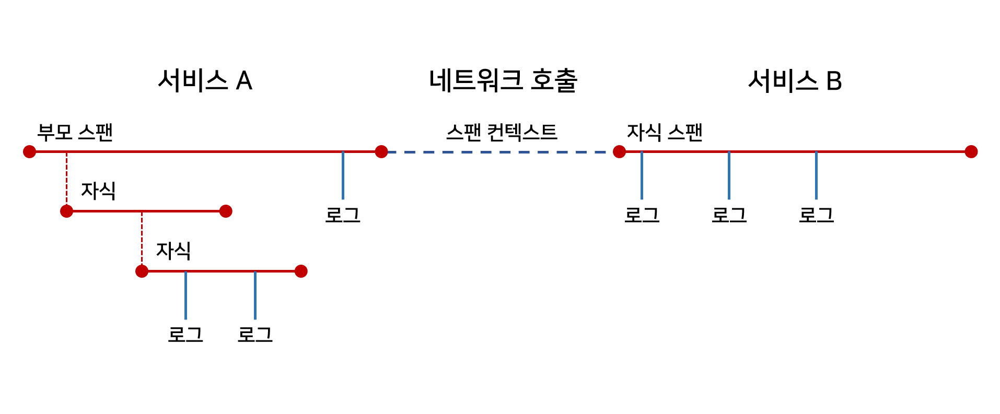

## 2020. 04. 26.

### OpenTracing 개요

#### 분산 추적:  심성 모델(mental model)

추적에 관한 대부분의 심성 모델들은 구글의 Dapper 논문에 기반한다. OpenTracing은 비슷한 동사와 명사를 사용한다.

1. 트레이스(Trace): 분산 시스템을 따라 움직이는 트랜잭션에 대한 설명
2. 스팬(Span):  하나의 워크플로우를 나타내는 이름과 시간이 지정된 연산. 스팬은 키:값 태그 뿐만 아니라 세분화되고 타임스탬프를 기록하여 특정 스팬 인스턴스에 연결된 구조화된 로그도 가질 수 있다.

3. 스팬 컨텍스트(Span context): 분산 트랜잭션은 언제 네트워크 또는 메세지 버스를 통해 서비스에서 서비스로 전달되는지를 포함한 트레이스 정보를 동반한다. 스팬 컨텍스트는 트레이스 식별자, 스팬 식별자 및 추적 시스템이 다운스트림 서비스로 전파하기 위해 필요한 데이터를 갖는다.

