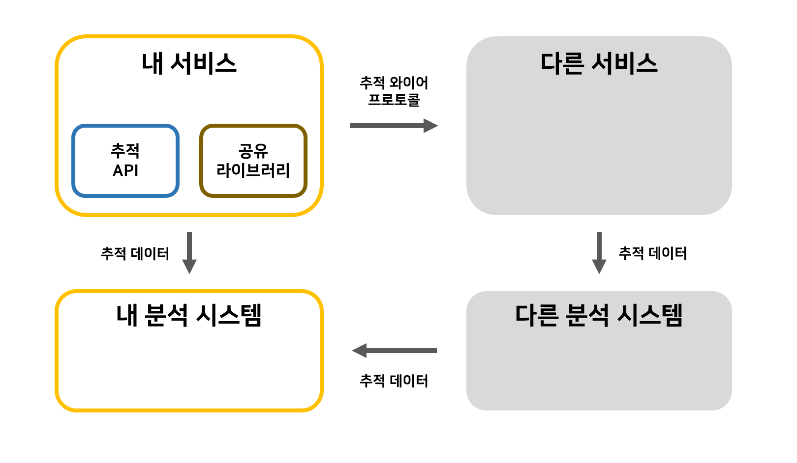

## 2020. 04. 27.

### 4대 요소

애플리케이션 계층 분산 추적 시스템의 관점에서, 현대 소프트웨어 시스템은 다음 다이어그램과 같이 볼 수 있다:

현대 소프트웨어 시스템의 컴포넌트는 세 종류로 나눌 수 있다:

* 애플리케이션과 비지니스 로직: 내가 작성한 코드.
* 널리 공유하는 라이브러리: 다른 사람이 작성한 코드.
* 널리 공유하는 서비스: 다른 사람의 인프라스트럭처.

이 세 컴포넌트는 서로 다른 요구사항을 가지고 있으며 애플리케이션을 모니터링하는 분산 추적 시스템의 설계를 주도한다. 그 결과로 만들어진 설계는 다음과 같은 네 개의 중요한 요소가 도출된다:

* 추적 편성(instrumentation) API: 애플리케이션 코드를 장식.
* 와이어 프로토콜: RPC 요청에서 애플리케이션 데이터와 함께 전송.
* 데이터 프로토콜: 분석 시스템에 동기적으로 전송.

* 분석 시스템: 추적 데이터로 작업하기 위한 데이터베이스 및 상호작용 UI

#### OpenTracing이 어떻게 여기에 적합한지?

OpenTracing API는 편성(instrumentation)에 대해 표준적이고 벤더 중립적인 프레임워크를 제공한다. 즉, 개발자가 다른 분산 추적 시스템을 사용해보고자 하는 경우 새 분산 추적 시스템을 위해 전체 편성 프로세스를 반복하는 대신, 개발자는 단순히 트레이서의 구성만 변경하면 된다.

