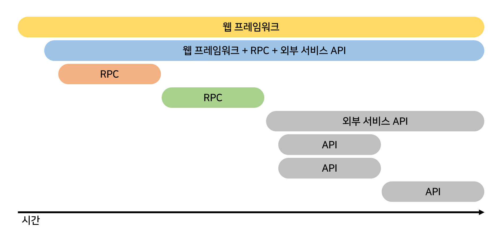
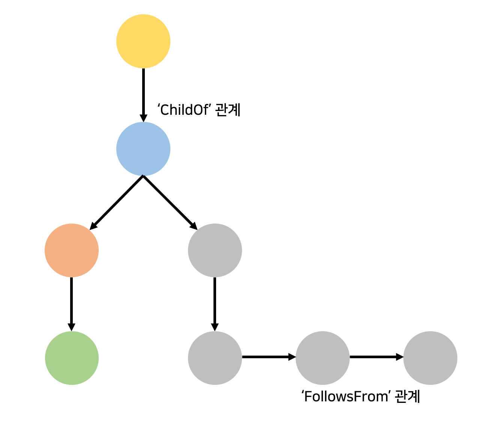

## 2020. 05. 26.

### OpenTracing - 애플리케이션 계측(1)

#### 스팬과 관계

OpenTracing 구현체의 두 핵심 요소는 *스팬*과 두 스팬 간의 *관계*이다:

* [*스팬*][opentracing-spans]은 분산 시스템에서 작업의 논리적인 단위이며 당연히 모두 이름, 시작 시간 및 기간(duration)을 갖는다. 추적에서 스팬들은 이들을 생성하는  분산 시스템과 연관된다.

  

* [*관계*][opentracing-relationship]는 두 스팬 긴의 연결이다. 하나의 스팬은 0개 이상의 다른 스팬과 인과적으로 연결될 수 있다. 스팬들 간의 이러한 연결은 실행중인 시스템의 의미(semantic) 뿐만 아니라 지연에 민감한 (분산) 트랜잭션에 대한 임계 경로(critical path)를 설명하는 데 도움이 된다.

  

여러분이 원하는 최종 상태는 코드의 모든 컴포넌트에 대한 스팬들을 해당 스팬들의 관계들과 함께 배출하는 것이다. 분산 추적과 함께 인프라를 구축하기 시작할 때, 가장 모범 사례는 서비스 프레임워크(e.g., RPC 계층) 혹은 여러 실행 경로로 다양하게 상호작용하는 것으로 알려진 다른 컴포넌트와 함께 시작하는 것이다.

OpenTracing으로 계측되는 서비스 프레임워크([gRPC][grpc], etc.)를 사용함으로써 더 적은 노력으로 시작할 수 있다. 하지만 계측되지 않은 프레임워크로 작업중인 경우 [IPC/RPC Framework Guide][ipc-rpc-framework-guide]를 읽어보는 것이 도움이 될 수 있다.

[opentracing-spans]: https://opentracing.io/specification/#the-opentracing-data-model
[opentracing-relationship]: https://opentracing.io/specification/#references-between-spans
[grpc]: https://github.com/grpc/grpc-go
[ipc-rpc-framework-guide]: https://opentracing.io/docs/best-practices/instrumenting-frameworks