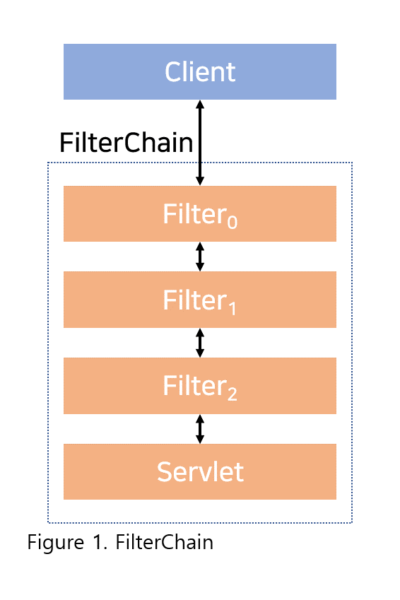

## 2020. 10. 12.

### Spring Security for Servlet - Servlet Security: The Big Picture(1)

이 섹션에서는 서블릿 기반 애플리케이션에서 Spring Security의 고수준 아키텍처에 대해 논의한다. 레퍼런스의 [인증][authentication-section], [인가][authrization-section], [공격에 대한 보호][protection-against-exploit-section] 섹션의 내용은 이러한 이해를 바탕으로 한다.

#### `Filter` 살펴보기

Spring Security의 서블릿 지원은 서블릿 `Filter`를 기반으로 하기 때문에, 먼저 `Filter`의 역할을 살펴보는 것이 도움이 된다. 아래의 그림은 단일 HTTP 요청에 대한 전형적인 핸들러의 계층을을 보여준다.



클라이언트가 애플리케이션으로 요청을 보내면 컨테이너는 요청 URI의 경로를 기반으로 `HttpServletRequest`를 처리해야 하는 `Filter`들과 `Servlet`을 갖는 `FilterChain`을 생성한다. Spring MVC 애플리케이션에서 `Servlet`은 [`DispatcherServlet`][dispatcher-servlet]의 인스턴스이다. 최대 하나의 `Servlet`이 하나의 `HttpServletRequest`와 `HttpServletResponse`를 처리할 수 있다. 하지만 하나 이상의 `Filter`가 다음의 경우에 사용될 수 있다:

* 다운스트림 `Filter` 혹은 `Servlet`이 실행되는 것을 방지한다. 이 경우 `Filter`가 보통 `HttpServletResponse`를 작성한다.
* 다운스트림 `Filter`와 `Servlet`에서 사용되는 `HttpServletRequest` 혹은 `HttpServletResponse`를 변형(modify)한다.

`Filter`의 힘은 넘겨지는 `FilterChain`으로부터 나온다.

**`FilterChain` 사용 예시**

```kotlin
fun doFilter(request: ServletRequest, response: ServletResponse, chain: FilterChain) {
    // do something before the rest of the application
    chain.doFilter(request, response) // invoke the rest of the application
    // do something after the rest of the application
}
```

`Filter`는 다운스트림 `Filter`들과 `Servlet`에만 영향을 주기 때문에 실행되는 `Filter`의 순서가 매우 중요하다.


[authentication-section]: https://docs.spring.io/spring-security/site/docs/5.4.1/reference/html5/#servlet-authentication
[authrization-section]: https://docs.spring.io/spring-security/site/docs/5.4.1/reference/html5/#servlet-authorization
[protection-against-exploit-section]: https://docs.spring.io/spring-security/site/docs/5.4.1/reference/html5/#servlet-exploits
[dispatcher-servlet]: https://docs.spring.io/spring/docs/current/spring-framework-reference/web.html#mvc-servlet