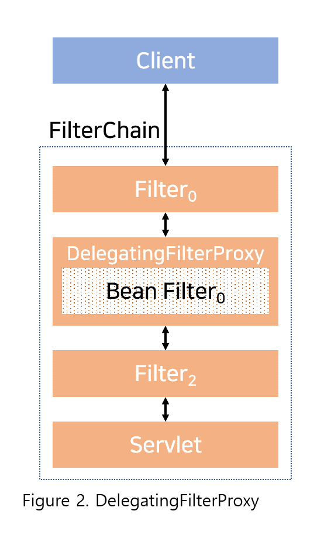

## 2020. 10. 13.

### Spring Security for Servlet - Servlet Security: The Big Picture(2)

#### DelegatingFilterProxy

Spring은 서블릿 컨테이너의 생명주기와 Spring의 `ApplicationContext` 사이를 잇는 [`DelegatingFilterProxy`][delegatingfilterproxy]라는 이름의 `Filter` 구현체를 제공한다. 서블릿 컨테이너는 고유한 표준을 통해 `Filter`를 등록할 수 있도록 하지만 Spring이 정의한 빈을 인지하지는 못한다. `DelegatingFilterProxy`는 표준 서블릿 컨테이너 메커니즘을 통해 등록될 수 있지만 모든 작업은 `Filter`를 구현한 Spring 빈에 위임(delegate)한다.

다음은 `DelegatingFilterProxy`가 어떻게 [`Filter`와 `FilterChain`][servlet-filter-review]에 맞추는지를 보여준다:




`DelegatingFilterProxy`는 `ApplicationContext`에서 *Bean Filter<sub>0</sub>*를 찾아 실행한다. `DelegatingFilterProxy`의 의사 코드는 아래와 같다:

```kotlin
fun doFilter(request: ServletRequest, response: ServletResponse, chain: FilterChain) {
    // Lazily get Filter that was registered as a Spring Bean
    // For the example in DelegatingFilterProxy delegate is an instance of Bean Filter0
    val delegate: Filter = getFilterBean(someBeanName)
    // delegate work to the Spring Bean
    delegate.doFilter(request, response)
}
```

`DelegatingFilterProxy`의 또다른 이점은 `Filter` 빈 인스턴스 조회를 늦출 수 있다는 점이다. 컨테이너를 시작하기 전에 `Filter` 인스턴스를 등록해야 하지만 Spring은 주로 Spring 빈을 로드하는 데 `ContextLoaderListener`를 사용하고, 이는  `Filter` 인스턴스가 등록돼야 하는 시점까지 끝나지 않기 때문에 중요하다.


[delegatingfilterproxy]: https://docs.spring.io/spring-security/site/docs/current/api/org/springframework/web/filter/DelegatingFilterProxy.html/
[servlet-filter-review]: https://docs.spring.io/spring-security/site/docs/5.4.1/reference/html5/#servlet-filters-review