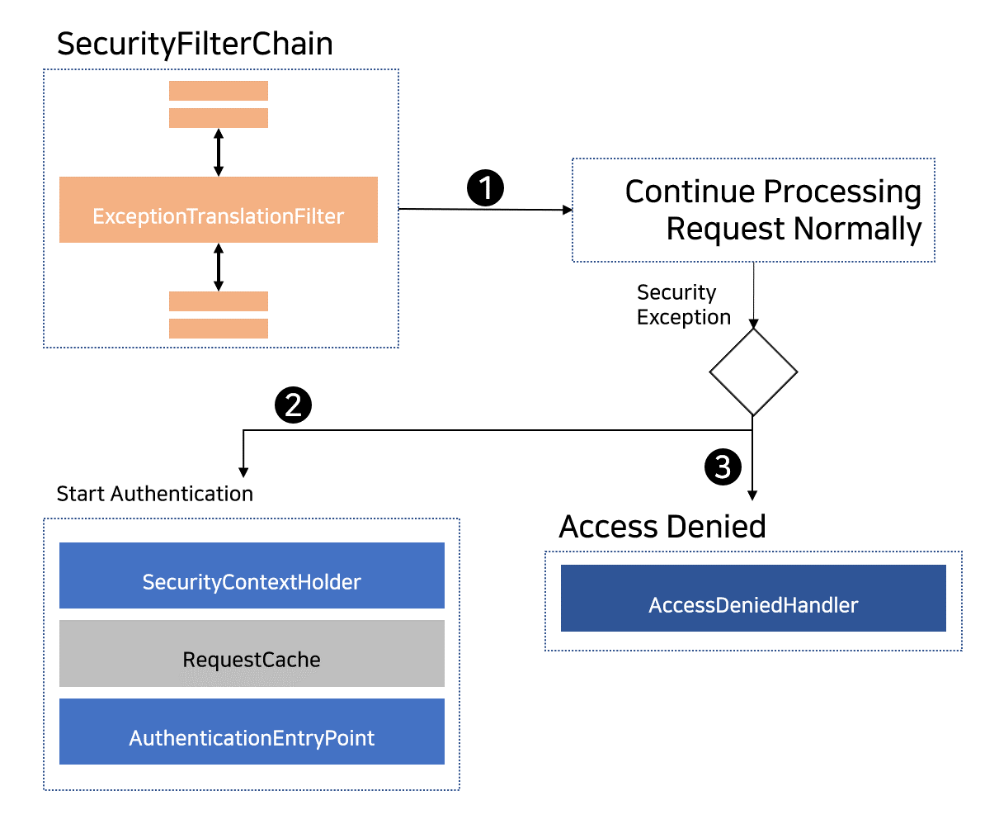

## 2020. 10. 17.

### Spring Security for Servlet - Servlet Security: The Big Picture(6)

#### 보안 예외 처리

[`ExceptionTranslationFilter`][exception-translation-filter]가 [`AccessDeniedException`][access-denied-exception]과 [`AuthenticationException`][authentication-exception]을 HTTP 응답으로 변환하도록 한다.

`ExceptionTranslationFilter`는 [보안 필터][security-filters]의 하나로 [FilterChainProxy][filter-chain-proxy]에 삽입된다.




1. 먼저, `ExceptionTranslationFilter`는 애플리케이션의 나머지를 실행하기 위해 `FilterChain.doFilter(request, response)`를 호출한다.
2. 만일 사용자가 인증되지 않았거나 `AuthenticationException`인 경우 *인증을 시작한다*.
   * [SecurityContextHolder][security-context-holder]를 비운다.
   * `HttpServletRequest`가 `RequestCache`에 저장된다. 사용자가 인증에 성공하면 원래 요청을 재생(replay)하기 위해 `ReuqestCache`가 사용된다.
   * 클라이언트로부터 크리덴셜을 요청하기 위해 `AuthenticationEntryPoint`가 사용된다. 예를 들어 로그인 페이지로 리다이렉트하거나 `WWW-Authenticate` 헤더를 보낸다.
3. 그 외에 `AcceessDeniedException`인 경우 *Access Denied*이다. `AccessDeniedHandler`가 이를 처리하기 위해 호출된다.

> 애플리케이션이 `AccessDeniedException` 혹은 `AuthenticationException`을 던지지 않으면 `ExceptionTranslationFilter`는 아무것도 하지 않는다.

`ExceptionTranslationFilter`의 의사코드는 다음과 같다:

**ExceptionTranslationFilter 의사코드**

```java
try {
    // 1. 애플리케이션의 나머지를 실행한다.
    // 애플리케이션의 다른 부분(i.e. `FilterSecurityInterceptor`나 메서드 보안)이 던지는 
    // `AuthenticationException`이나 `AccessDeniedException`은 이곳에서 잡혀 처리된다.
    filterChain.doFilter(request, response);
} catch (AccessDeniedException | AuthenticationException ex) {
    if (!authenticated || ex instanceof AuthenticationException) {
        // 2. 사용자가 인증되지 않았거나 `AuthenticationException`이면 *인증을 시작한다*.
        startAuthentication(); 
    } else {
        // 3. 그 외에는 *Access Denied*가 된다.
        accessDenied(); 
    }
}
```


[exception-translation-filter]: https://docs.spring.io/spring-security/site/docs/current/api/org/springframework/security/web/access/ExceptionTranslationFilter.html
[access-denied-exception]: https://docs.spring.io/spring-security/site/docs/current/api/org/springframework/security/access/AccessDeniedException.html
[authentication-exception]: https://docs.spring.io/spring-security/site/docs/current/api//org/springframework/security/core/AuthenticationException.html
[security-filters]: https://docs.spring.io/spring-security/site/docs/5.4.1/reference/html5/#servlet-security-filters
[filter-chain-proxy]: https://docs.spring.io/spring-security/site/docs/5.4.1/reference/html5/#servlet-security-filters
[security-context-holder]: https://docs.spring.io/spring-security/site/docs/5.4.1/reference/html5/#servlet-authentication-securitycontextholder