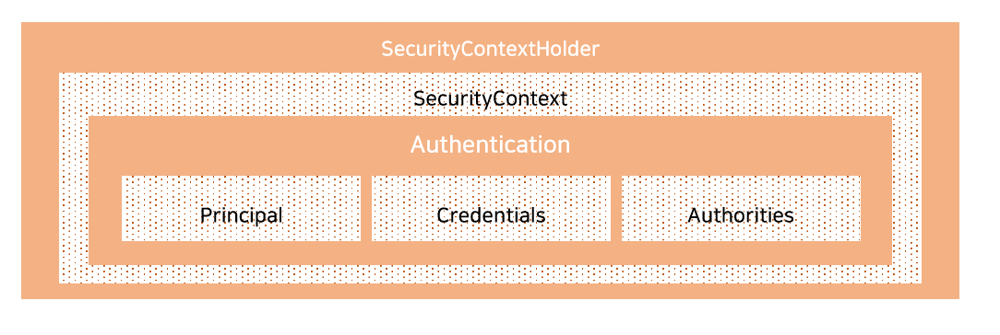

## 2020. 10. 19.

### Spring Security for Servlet - 인증(2)

#### SecurityContextHolder

Spring Security의 인증 모델의 심장은 [SecurityContext][security-context]를 갖는 `SecurityContextHolder`이다. 



`SecurityContextHolder`는 Spring Security가 [인증된][spring-security-authentication] 사람에 대한 상세 정보를 저장하는 곳이다. Spring Security는 `SecurityContextHolder`가 채워지는(populated) 방법에 대해서는 신경쓰지 않는다. 값을 갖고 있다면 현재 인증된 사용자라는 의미이다.

사용자의 인증 여부를 나타내는 가장 단순한 방법은 `SecurityContextHolder`에 직접 값을 설정하는 것이다.

**에시 53. `SecurityContextHolder` 설정**

```kotlin
// 1. 비어 있는 `SecurityContext`를 생성하는 것으로 시작한다.
// 여러 스레드 사이의 경쟁 조건을 피하기 위해 `SecurityContextHolder.getContext().setAuthentication(authentication)을 
// 사용하는 대신 새로운 `SecurityContext`를 생성한다는 점이 중요하다.
val context: SecurityContext = SecurityContextHolder.createEmptyContext() 
// 2. 다음으로 새로운 `Authentication` 객체를 생성한다.
// Spring Security는 어떤 유형의 `Authentication` 구현이 `SecurityContext`에 설정되는지는 신경쓰지 않는다.
// 여기서는 매우 단순한 `TestingAuthenticationToken`을 사용한다.
// 더 흔한 프로덕션에서의 시나리오는 `UsernamePasswordAuthenticationToken(userDetails, password, authorities)`이다.
val authentication: Authentication = TestingAuthenticationToken("username", "password", "ROLE_USER") 
context.authentication = authentication

// 3. 마지막으로 `SecurityContexxtHolder`에 `SecurityContext`를 설정한다.
// Spring Security는 이 정보를 인가(authorization)에 사용한다.
SecurityContextHolder.setContext(context) 
```

인증된 주체(principal)에 관한 정보를 얻고자 하는 경우, `SecurityContextHolder`에 접근하면 된다.

**예제 54. 현재 인증된 사용자에 접근**

```kotlin
val context = SecurityContextHolder.getContext()
val authentication = context.authentication
val username = authentication.name
val principal = authentication.principal
val authorities = authentication.authorities
```

기본적으로 `SecurityContextHolder`는 이러한 세부 정보를 저장하는 데에 `ThreadLocal`을 사용한다. 즉, 같은 스레드의 메서드에서는 명시적으로 인자로 `SecurityContext`를 전달하지 않아도 `SecurityContext`를 사용할 수 있다는 의미이다. 이 방법으로`ThreadLocal`을 사용하는 것은 현재 보안 주체의 요청이 처리된 후에 스레드를 비우도록 신경쓴다면 꽤 안전하다. Spring Security의 [FilterChainProxy][filter-chain-proxy]가 `SecurityContext`가 항상 비워지도록 보장한다. 

일부 애플리케이션은 스레드를 사용하는 특별한 방법으로 인해 `ThreadLocal`을 사용하는 것이 맞지 않을 수도 있다. 예를 들어 Swing 클라이언트는 JVM의 모든 스레드가 같은 보안 컨텍스트를 사용하길 원할 수 있다. 시작할 때 `SecurityContextHolder`를 특정한 방법으로 컨텍스트를 저장하도록 전략을 구성할 수 있다. 단독 애플리케이션에서는 `SecurityContextHolder.MODE_GLOBAL` 전략을 사용하고자 할 수 있다. 다른 애플리케이션은 동일한 보안 아이덴티티를 가정하는 보안 스레드가 생성하는 스레드를 원할 수도 있다. `SecurityContextHolder.MODE_INHERITABLETHREADLOCAL`을 이용해 이를 달성할 수 있다. 기본 `SecurityContextHolder.MODE_THREADLOCAL`을 두 가지 방법으로 변경할 수 있다. 첫 번째는 시스템 프로퍼티이고, 두 번째는 `SecurityContextHolder`의 정적 메서드 호출이다. 대부분의 애플리케이션은 기본값을 바꿀 필요가 없지만, 필요한 경우에는 `SecurityContextHolder`의 JavaDoc을 참고하라. 


[security-context]: https://docs.spring.io/spring-security/site/docs/5.4.1/reference/html5/#servlet-authentication-securitycontext
[spring-security-authentication]: https://docs.spring.io/spring-security/site/docs/5.4.1/reference/html5/#authentication
[filter-chain-proxy]: https://docs.spring.io/spring-security/site/docs/5.4.1/reference/html5/#servlet-filterchainproxy