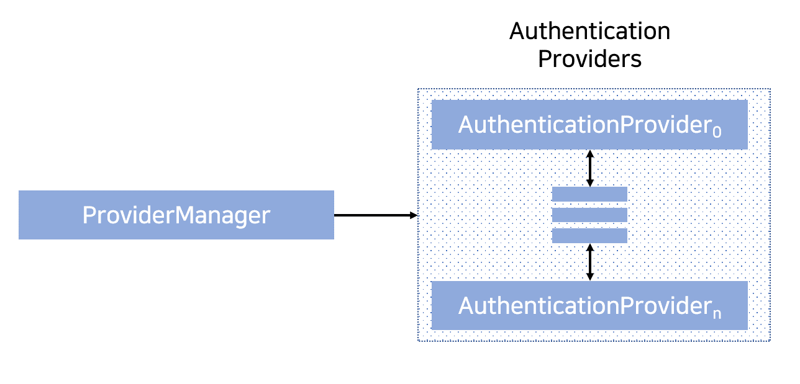
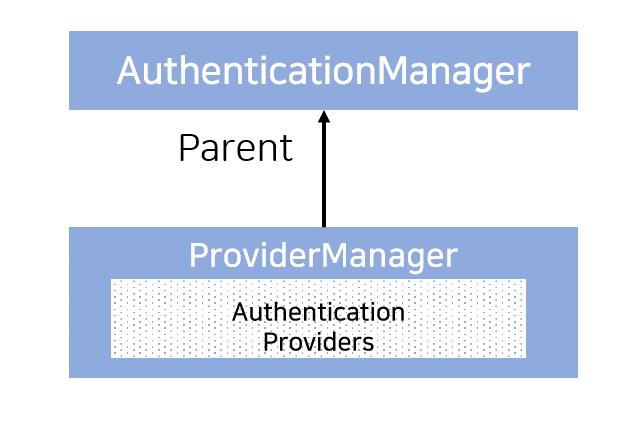
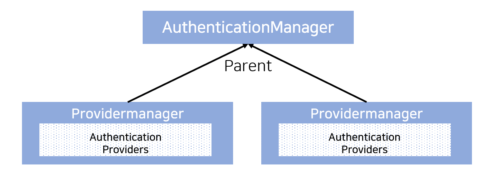

## 2020. 10. 23.

### Spring Security for Servlet - 인증(6)

#### ProviderManager

[`ProviderManager`][provider-manager]는 가장 흔하게 사용되는 [`AuthenticationManager`][authentication-manager] 구현체다. `ProviderManager`는 [`AuthenticationProvider`][autentication-provider]의 `List`에 위임한다. 각 `AuthenticationProvider`는 인증이 성공, 실패했거나 결과를 알 수 없어 다운스트림 `AuthenticationProvider`가 이를 결정하도록 할 지 나타낼 기회를 갖는다. 만일 구성된 `AuthenticationProvider`로 인증할 수 없으면 해당 인증은 `ProviderManager`가 전달된 `Authentication` 유형을 지원하도록 구성되지 않았음을 나타내는 특별한 `AuthenticationException`인 `ProviderNotFoundException`과 함께 실패한다.

실질적으로 각 `AuthenticationProvider`는 구체적인 유형의 인증을 수행하는 방법을 알고 있다. 예를 들어 한 `AuthenticationProvider`는 유저네임/패스워드의 유효성을 확인할 수 있다. 반면에, 또 다른 `AuthenticationProvider`는 SAML 단정(assertion)을 인증할 수 있다. 이는 각 `AuthenticationProvider`가 구체적인 유형의 인증을 수행하면서도 여러 종류의 인증을 지원하며 하나의 `AuthenticationManager` 빈만을 노출할 수 있도록 한다.

`ProviderManager`는 선택적으로 인증을 수행할 수 있는 `AuthenticationProvider`가 없는 경우 참조되는 부모 `AuthenticationManager`를 구성할 수 있도록 한다. 부모는 `AuthenticationManager`의 어느 타입이든 될 수 있지만 주로 `ProviderManager`의 인스턴스이다.

실제로는 여러 `ProviderManager` 인스턴스들이 같은 부모 `AuthenticationManager`를 공유한다. 이는 공통 인증(공유하는 `AuthenticationManager`) 뿐만 아니라 서로 다른 인증 메커니즘(서로 다른 `ProviderManager` 인스턴스들)을 갖는 여러 개의 [`SecurityFilterChain`][security-filter-chain] 인스턴스가  존재하는 시나리오에서는 다소 흔하다.

기본적으로 `ProviderManager`는 성공한 인증 요청에서 반환된  `Authentication` 객체의 민감한 크리덴셜 정보를 지우려고 시도한다. 이는 패스워드와 같은 정보가 `HttpSession`에서 필요 이상으로 오래 유지되는 것을 방지한다.

이는 사용자 객체의 캐시를 사용하는 경우 문제가 될 수 있다. 예를 들면 무상태(stateless) 애플리케이션에서 성능 향상을 위해 사용하는 경우가 있다. `Authentication`이 (`UserDetails` 인스턴스와 같은)캐시에 있는 객체의 참조를 가지면 크리덴셜이 지워진다. 그러고 나면 더이상 캐시된 값에 대해 인증할 수 없게 된다. 캐시를 사용하는 경우에는 이를 계정으로 가져가야 한다. 명확한 해답은 캐시 구현체든, 반환된 `Authentication`을 생성한 `AuthenticationProvider`에서든 일단 객체의 복사본을 만드는 것이다. 혹은, 그 대신 `ProviderManager`의 `eraseCredentialsAfterAuthentication` 프로퍼티를 비활성화할 수도 있다. 자세한 내용은 [Javadoc][provider-manager-javadoc] 참고.

[provider-manager]: https://docs.spring.io/spring-security/site/docs/current/api/org/springframework/security/authentication/ProviderManager.html
[authentication-manager]: https://docs.spring.io/spring-security/site/docs/5.4.1/reference/html5/#servlet-authentication-authenticationmanager
[autentication-provider]: https://docs.spring.io/spring-security/site/docs/5.4.1/reference/html5/#servlet-authentication-authenticationprovider
[provider-manager-javadoc]: https://docs.spring.io/spring-security/site/docs/current/api/org/springframework/security/authentication/ProviderManager.html