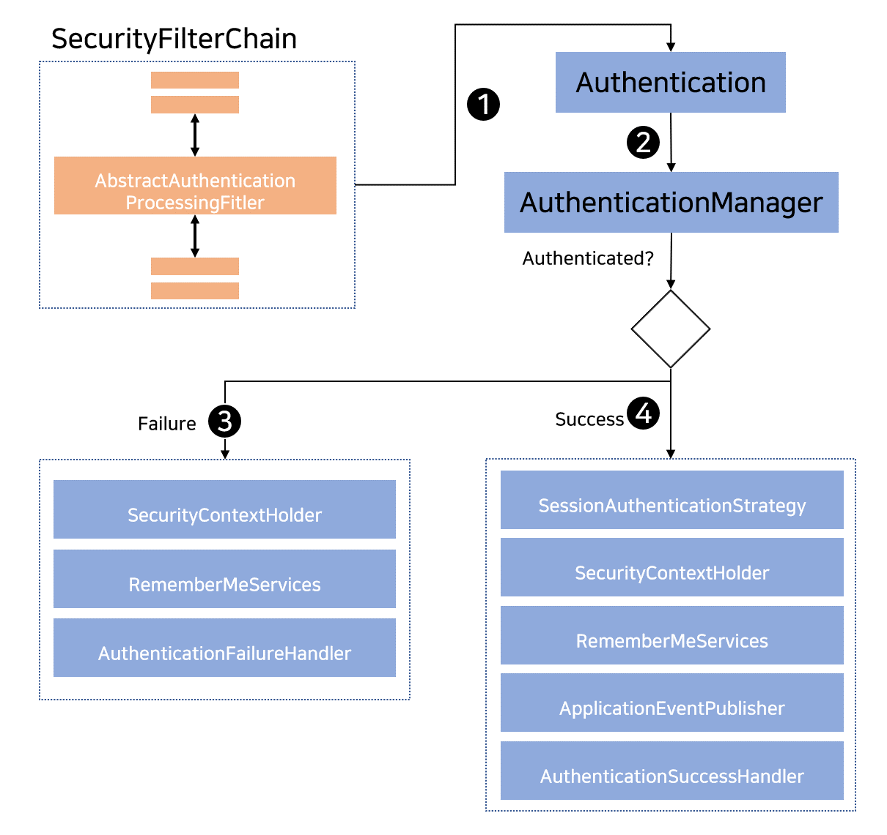

## 2020. 10. 25.

### Spring Security for Servlet - 인증(8)

#### AbstractAuthenticationProcessingFilter

[`AbstractAuthenticationProcessingFilter`][abstract-authentication-processing-filter]는 사용자의 크리덴셜을 인증하기 위한 기반 `Filter`로 사용된다. 크리덴셜이 인증되기 전에 Spring Security는 [`AutenticationEntryPoint`][authentication-entry-point]를 사용해 크리덴셜을 주로 요청한다.

그 다음, `AbstractAuthenticationProcessingFilter`가 보내진 임의의 인증 요청을 인증할 수 있다.

1. 사용자가 자신의 크리덴셜을 보내면 `AbstractAuthenticationProcessingFilter`는 인증돼야 하는 `HttpServletRequest`로부터 [`Authentication`][authentication]을 만든다. `Authentication`의 유형은 `AbstractAuthenticationProcessingFilter`의 서브클래스에 따라 다르다. 예를 들어, [`UsernamePasswordAuthenticationFilter`][username-password-authentication-filter]는 `HttpServletRequest`에 보내진 *유저네임*과 *패스워드*로부터 `UsernamePasswordAuthenticationToken`을 생성한다.
2. 그 다음, [`Authentication`][authentication]이 인증돼야 하는 [`AuthenticationManager`][authentication-manager]로 전달된다.
3. 만약 인증이 실패하면, *실패*한다
   * [SecurityContextHolder][security-context-holder]가 비워진다.
   * `RememberMeServices.loginFail`이 호출된다. 사용자 기억하기(remember me)가 구성되지 않은 경우에는 아무 동작도 하지 않는다.
   * `AuthenticationFailureHandler`가 호출된다.
4. 만약 인증이 성공하면 *성공*한다
   * `SessionAuthenticationStrategy`에 새로운 로그인을 알린다.
   * [SecurityContextHolder][security-context-holder]에 [Authentication][authentication]을 설정한다. 이후에 `SecurityContextPersistenceFilter`가 `SecurityContext`를 `HttpSession`에 저장한다.
   * `RememberMeServices.loginSuccess`가 호출된다. 사용자 기억하기(remember me)가 구성되지 않은 경우에는 아무 동작도 하지 않는다.
   * `ApplicationEventPublisher`가 `InteractiveAuthenticationSuccessEvent`를 게시한다.
   * `AuthenticationSuccessHandler`가 호출된다.

[abstract-authentication-processing-filter]: https://docs.spring.io/spring-security/site/docs/current/api/org/springframework/security/web/authentication/AbstractAuthenticationProcessingFilter.html
[authentication-entry-point]: https://docs.spring.io/spring-security/site/docs/5.4.1/reference/html5/#servlet-authentication-authenticationentrypoint
[authentication]: https://docs.spring.io/spring-security/site/docs/5.4.1/reference/html5/#servlet-authentication-authentication
[username-password-authentication-filter]: https://docs.spring.io/spring-security/site/docs/5.4.1/reference/html5/#servlet-authentication-usernamepasswordauthenticationfilter
[authentication-manager]: https://docs.spring.io/spring-security/site/docs/5.4.1/reference/html5/#servlet-authentication-authenticationmanager
[security-context-holder]: https://docs.spring.io/spring-security/site/docs/5.4.1/reference/html5/#servlet-authentication-securitycontextholder