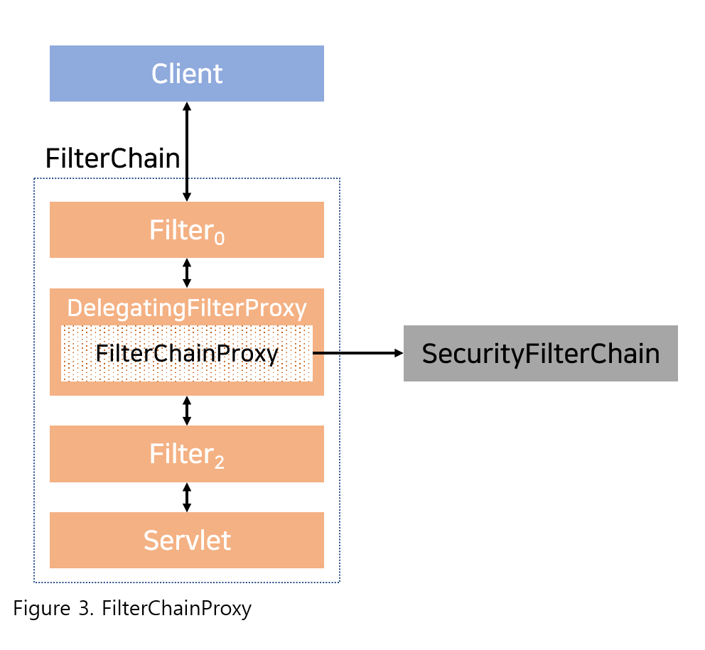

## 2020. 10. 14.

### Spring Security for Servlet - Servlet Security: The Big Picture(3)

#### FilterChainProxy

Spring Security의 서블릿 지원은 `FilterChainProxy`에 포함돼 있다. `FilterChainProxy`는 Spring Security가 제공하는 특수한 ``Filter`로,  [`SecurityFilterChain`][security-filter-chain]을 통해 다수의 `Filter` 인스턴스에 위임한다. `FilterChainProxy`는 빈이기 때문에 주로 `DelegatingFilterProxy`에 래핑돼 있다.

[security-filter-chain]: https://docs.spring.io/spring-security/site/docs/5.4.1/reference/html5/#servlet-securityfilterchain