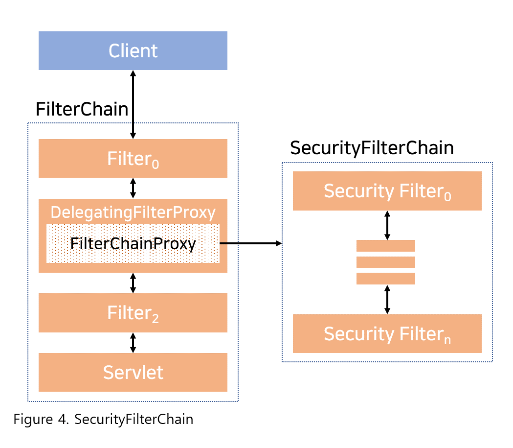
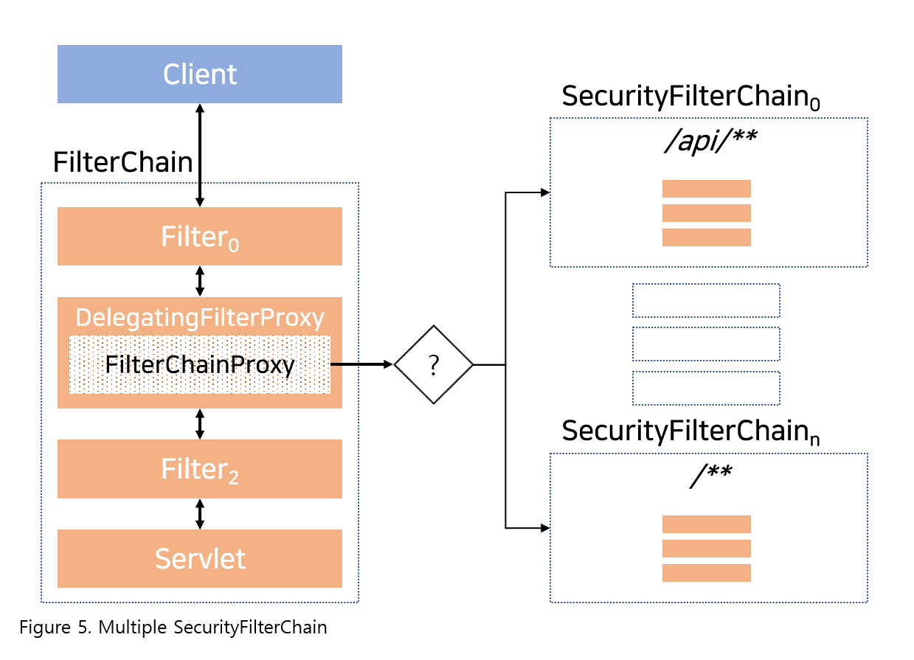

## 2020. 10. 15.

### Spring Security for Servlet - Servlet Security: The Big Picture(4)

#### SecurityFilterChain

[`SecurityFilterChain`][security-filter-chain]은 [FilterChainProxy][filter-chain-proxy]가 요청에 대해 어느 Spring Security `Filter`를 실행해야 하는지 결정하는 데 사용된다.

`SecurityFilterChain` 내의 [Security Filter][security-filters]들은 주로 빈이지만 [DelegatingFilterProxy][delegating-filter-proxy] 대신 `FilterChainProxy`에 등록된다. `FilterChainProxy`를 서블릿 컨테이너 혹은 [DelegatingFilterProxy][delegating-filter-proxy]에 직접 등록하는 것은 몇가지 이점을 제공한다. 첫 번째, 모든 Spring Security의 서블릿 지원에 대한 출발점을 제공한다. 때문에, Spring Security의 서블릿 지원에 대한 문제를 해결하려 할 때 `FilterChainProxy`에 디버그 지점을 추가하는 것이 좋은 시작점이다.

두 번째, `FilterChainProxy`는 Spring Security 사용의 핵심이기 때문에 선택사항이 아닌 작업들을 수행할 수 있다. 예를 들어, 메모리 누수를 피하기 위해 `SecurityContext`를 비운다. 또한 특정 유형의 공격으로부터 애플리케이션을 보호하기 위해 Spring Security의 [`HttpFirewall`][http-firewall]을 적용한다.

추가로, `SecurityFilterChain`이 실행돼야 할 때 더욱 유연함을 제공한다. 서블릿 컨테이너에서 `Filter`들은 URL만을 기반으로 실행된다. 하지만 `FilterChainProxy`는 실행 여부를 결정하는 데에 `RequestMatcher` 인터페이스의 이점을 이용하여 `HttpServletRequest`에 있는 어느 것이든 활용할 수 있다.

실제로, `FilterChainProxy`는 어느 `SecurityFilterChain`을 사용해야 하는지 결정할 수 있다. 이는 애플리케이션에 완전히 별개 *조각(slice)*의 구성을 제공할 수 있도록 한다.

[복수의 SecurityFilterChain][multiple-security-filter-chain] 그림에서 `FilterChainProxy`는 어느 `SecurityFilterChain`을 사용해야 할 지 결정한다. 첫 번째로 일치하는 `SecurityFilterChain`이 실행될 것이다. 만일 URL이 `/api/messages`인 요청이 오면, 먼저 패턴이 `/api/**`인 <code>SecurityFilterChain0</code>를 일치시킨다. 따라서 <code>SecurityFilterChainn</code>에 일치하더라도 오직 <code>SecurityFilterChain0</code>만이 실행될 것이다. 만일 URL이 `/messages/`인 요청이 온다면 패턴이 `/api/**`인 <code>SecurityFilterChain0</code>의 패턴에는 일치하지 않으므로 `FilterChainProxy`는 계속하여 각 `SecurityFilterChain`을 시도할 것이다. 다른 것이 없다면 `SecurityFilterchain` 인스턴스는 <code>SecurityFilterChainn</code>을 실행할 것이다.

<code>SecurityFilterChain0</code>는 오직 세 개의 보안 `Filter` 인스턴스를 구성했다는 점을 알아두자. 하지만 <code>SecurityFilterChainn</code>은 네 개의 보안 `Filter`로 구성됐다. 각 `SecurityFilterChain`이 고유(unique)할 수 있고 격리되어 구성될 수 있다는 점을 아는 것이 중요하다. 실제로, 애플리케이션이 특정 요청은 Spring Security가 무시하기를 원하는 경우 `SecurityFilterChain`은 보안 `Filter`를 갖지 않을 수도 있다.

[security-filter-chain]: https://docs.spring.io/spring-security/site/docs/current/api/org/springframework/security/web/SecurityFilterChain.html
[filter-chain-proxy]: https://docs.spring.io/spring-security/site/docs/5.4.1/reference/html5/#servlet-filterchainproxy
[security-filters]: https://docs.spring.io/spring-security/site/docs/5.4.1/reference/html5/#servlet-security-filters
[delegating-filter-proxy]: https://docs.spring.io/spring-security/site/docs/5.4.1/reference/html5/#servlet-delegatingfilterproxy
[http-firewall]:  https://docs.spring.io/spring-security/site/docs/5.4.1/reference/html5/#servlet-httpfirewall