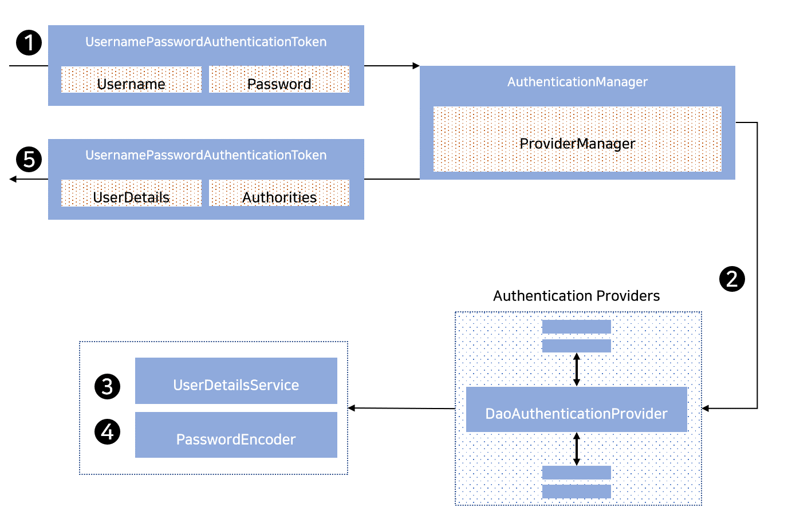

## 2020. 11. 02.

### Spring Security for Servlet - 인증(14)

#### PasswordEncoder

Spring Security의 서블릿 지원은 [`PasswordEncoder`][password-encoder]를 사용해 패스워드를 안전하게 저장한다. [`PasswordEncoder`를 빈으로 노출][password-storage-configuration]하여 Spring Security가 사용하는 `PasswordEncoder` 구현체를 커스터마이즈할 수 있다.

#### DaoAuthenticationProvider

[`DaoAuthenticationProvider`][dao-authentication-provider]는 [`UserDetailsService`][user-details-service]와 [`PasswordEncoder`][password-encoder]를 활용하는 [`AuthenticationProvider`][authentication-provider] 구현체이다.

Spring Security에서`DaoAuthenticationProvider`가 동작하는 방법을 살펴보자. 아래 그림은 [유저네임 & 패스워드 입력][username-password-input]에서 [`AuthenticationManager`][authentication-manager]가 동작하는 방법을 자세히 설명한다.

**그림 10. `DaoAuthenticationProvider` 사용**

1. 인증 `Filter`는 [유저네임 & 패스워드 입력][username-password-input]에서 `UsernamePasswordAuthenticationToken`을 [`ProviderManager`][provider-manager]가 구현한 `AuthenticationManager`에게 전달한다.
2. `ProviderManager`는 `DaoAuthenticationProvider` 타입의 [AuthenticationProvider][authentication-provider]를 사용하도록 구성된다.
3. `DaoAuthenticationProvider`는 `UserDeatilsService`로부터 `UserDetails`를 조회한다.
4. 그 다음 `DaoAuthenticationProvider`는 [`PasswordEncoder`][password-encoder]를 사용해 이전 단계에서 반환된 `UserDetails`의 패스워드가 유효한지 확인한다.
5. 인증이 성공하면 `UsernamePasswordAuthenticationToken` 타입이고 구성된 `UserDetailsService`가 반환한 `UserDetails`를 주체(principal)로 갖는 [`Authentication`][authentication]이 반환된다. 궁극적으로는, 반환된 `UsernamePasswordAuthenticationToken`은 인증 `Filter`가 [`SecurityContextHolder`][security-context-holder]에 설정한다.

[password-encoder]: https://docs.spring.io/spring-security/site/docs/5.4.1/reference/html5/#authentication-password-storage
[password-storage-configuration]: https://docs.spring.io/spring-security/site/docs/5.4.1/reference/html5/#authentication-password-storage-configuration
[dao-authentication-provider]: https://docs.spring.io/spring-security/site/docs/current/api/org/springframework/security/authentication/dao/DaoAuthenticationProvider.html
[user-details-service]: https://docs.spring.io/spring-security/site/docs/5.4.1/reference/html5/#servlet-authentication-userdetailsservice
[authentication-provider]: https://docs.spring.io/spring-security/site/docs/5.4.1/reference/html5/#servlet-authentication-authenticationprovider
[authentication-manager]: https://docs.spring.io/spring-security/site/docs/5.4.1/reference/html5/#servlet-authentication-authenticationmanager
[username-password-input]: https://docs.spring.io/spring-security/site/docs/5.4.1/reference/html5/#servlet-authentication-unpwd-input
[provider-manager]: https://docs.spring.io/spring-security/site/docs/5.4.1/reference/html5/#servlet-authentication-providermanager
[authentication]: https://docs.spring.io/spring-security/site/docs/5.4.1/reference/html5/#servlet-authentication-authentication
[security-context-holder]: https://docs.spring.io/spring-security/site/docs/5.4.1/reference/html5/#servlet-authentication-securitycontextholder