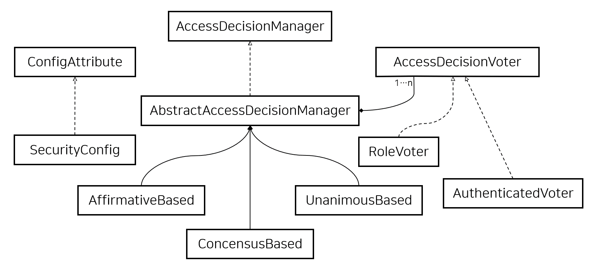

## 2020. 12. 23.

### Spring Security for Servlet - 인가(4)

##### 투표 기반 AccessDecisionManager 구현체

인가의 모든 측면(aspect)를 통제하기 위해 사용자들이 직접 `AccessDecisionManager`를 구현할 수도 있지만, Spring Security는 투표에 기반한 몇 가지 `AccessDecisionManager` 구현체를 포함하고 있다. [Voting Decision Manager][voting-decision-manager]가 관련 클래스들을 설명한다. 



*그림 11. 투표 결정 관리자*

이 접근 방식을 이용해 여러 개의 `AccessDecisionVoter` 구현체가 인가 결정에 참여한다. 그 다음 `AccessDecisionManager`는 투표 결과에 따라 `AccessDeniedException`을 던진지 여부를 결정한다.

`AccessDecisionVoter` 인터페이스는 세 개의 메서드를 갖는다:

```java
int vote(Authentication authentication, Object object, Collection<ConfigAttribute> attrs);

boolean supports(ConfigAttribute attribute);

boolean supports(Class clazz);
```

구현체들은 `int`를 반환하는데, `AccessDecisionVoter`의 정적 필드 `ACCESS_ABSTAIN`, `ACCESS_DENIED`, `ACCESS_GRANTED` 중 하나여야 한다. 투표 구현체가 인가 결정에 의견을 내지 않으면 `ACCESS_ABSTAIN`을 반환한다. 의견을 내는 경우에는 `ACCESS_DENIED`나 `ACCESS_GRANTED` 중 하나여야 한다.

Spring Security는 투표를 집계하는 세 개의 `AccessDecisionManager` 구현체를 제공한다. `ConsensusBased` 구현체는 기권표 이외의 컨센서스를 기반으로 접근을 허용하거나 거부한다. 프로퍼티를 이용해 동률인 경우나 모두 기권표인 경우의 동작을 제어할 수 있다. `AffirmativeBased` 구현체는 하나 이상의 `ACCESS_GRANTED` 표를 수신하면 접근을 허용한다(i.e. 한 개의 승인 표가 있다면 거부 표는 무시된다). `ConsensusBased` 구현체처럼 모두 기권표인 경우의 동작을 제어하는 파라미터가 있다. `UnanimousBased` 제공자는 접근 승인을 위해 만장일치로 `ACCESS_GRANTED` 표를 받아야 한다. 기권표는 무시한다. `ACCESS_DENIED` 표가 있다면 접근을 거부한다. 다른 구현체들처럼 모두 기권표인 경우의 동작을 제어하는 파라미터가 있다.

표를 다르게 집계하는 커스텀 `AccessDecisionManager`를 구현할 수도 있다. 예를 들어, 특정 `AccessDecisionVoter`에 가중치를 주거나 특정 투표자가 거부권을 갖는 등의 방식도 가능할 것이다.


[voting-decision-manager]: https://docs.spring.io/spring-security/site/docs/5.4.1/reference/html5/#authz-access-voting