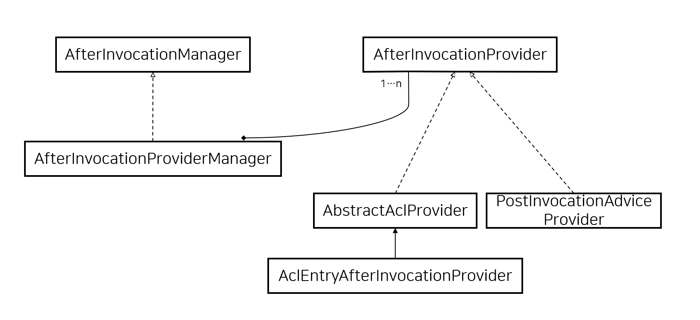

## 2020. 12. 27.

### Spring Security for Servlet - 인가(8)

#### 실행 후 처리(After invocation Handling)

`AccessDecisionManager`는 `AbstractSecurityInterceptor`에 의해 보안 객체 실행 전에 호출되는데, 어떤 애플리케이션들은 보안 객체가 반환한 실제 객체를 변경할 방법을 필요로 한다. 이를 위해 AOP를 쉽게 직접 구현할 수도 있지만, Spring Security는 ACL 기능과 통합하는 몇 가지 편리한 훅 구현체를 제공한다. 

[실행 후 구현][after-invocation-impl]은 Spring Security의 `AfterInvocationManager`와 이에 대한 구현체들을 나타낸다.

*그림 12. 실행 후 구현체*

Spring Security의 나른 많은 부분들처럼, `AfterInvocationManager`는 `AfterInvocationProvider`의 리스트를 폴링하는 하나의 구현체 `AfterInvocationProviderManager`를 갖는다. 각 `AfterInvocationProvider`는 반환 객체를 변경하거나 `AccessDeniedException`을 던지는 것이 허용된다. 여러 제공자들이 객체를 변환할 수 있으며, 이전 제공자의 결과가 리스트의 다음으로 넘겨진다.

`AfterInvocationManager`를 사용중인 경우, 작업을 허용하기 위해 `MethodSecurityInterceptor`의 `AccessDecisionManager`를 허용하기 위해 여전히 구성 속성이 필요하다는 점을 알아두자. 전형적인 Spring Security에 포함된 `AccessDecisionManager` 구현체를 사용중인 경우, 특정 보안 메서드 실행에 대한 구성 속성이 없으면 각 `AccessDecisionVoter`가 투표에서 기권한다. 결과적으로 `AccessDecisionManager`의 "allowIfAllAbstainDecisions" 프로퍼티가 `false`인 경우, `AccessDeniedException`이 던져질 것이다. 이 잠재적인 문제를 피하기 위해 (i) (일반적으로 권장하지 않지만)"allowIfAllAbstainDecisions"를 `true`로 설정하거나, (ii) 접근 허용을 위해 `AccessDecisionVoter`가 투표할 구성 속성이 적어도 하나가 있음을 보장한다. (권장하는) 후자의 접근법은 `ROLE_USER` 혹은 `ROLE_AUTHENTICATED` 구성 속성으로 달성할 수 있다.

[after-invocation-impl]: https://docs.spring.io/spring-security/site/docs/5.4.1/reference/html5/#authz-after-invocation