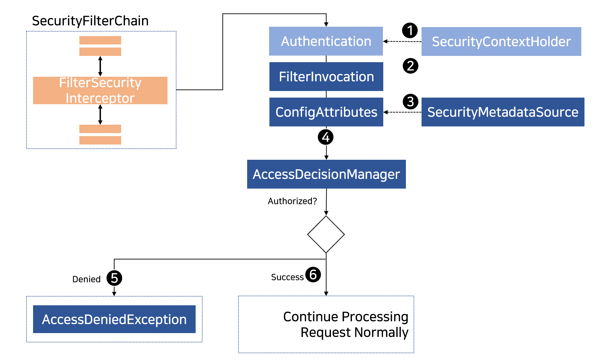

## 2020. 12. 29.

### Spring Security for Servlet - 인가(10)

#### FilterSecurityInterceptor로 HttpServletRequest 인가

이 섹션은 [서블릿 아키텍처와 구현][servlet-arch-and-impl]을 바탕으로 서블릿 기반 애플리케이션에서 [인가][authorization]가 동작하는 방법을 깊이 살펴본다.

[`FilterSecurityInterceptor`][filter-security-interceptor]는 `HttpServletRequest`에 대한 [인가][authorization]를 제공한다. [보안 필터][security-filters]의 하나로 [FilterChainProxy][filter-chain-proxy]에 삽입된다.



*그림 13. HttpServletRequest 인가*


1. 먼저, `FilterSecurityInterceptor`는 [`SecurityContextHolder`][security-context-holder]로부터 [`Authentication`][authentication]을 얻는다.
2. 두 번째로, `FilterSecurityInterceptor`는 `FilterSecurityInterceptor`로 전달된 `HttpServletRequest`, `HttpServletResponse`, `FilterChain`으로부터 [`FilterInvocation`][filter-invocation]을 생성한다.
3. 다음으로, `ConfigAttribute`들을 얻기 위해 `FilterInvocation`을 `SecurityMetadataSource`로 전달한다.
4. 마지막으로, `Authentication`, `FilterInvocation`, `ConfigAtrribute`를 `AccessDecisionManager`에 전달한다.
   5. 인가가 무시되면, `AccessDeniedException`이 던져진다. 이 경우 [`ExceptionTranslationFilter`][exception-translation-filter]가 `AccessDeniedException`을 처리한다.
   6. 인가가 허용되면, `FilterSecurityInterceptor`는 애플리케이션이 평소처럼 처리할 수 있게 [FilterChain][filter-chain]을 계속한다.

기본적으로 Spring Security의 인가는 모든 요청이 인증되어 있어야 한다. 명시적인 구성은 다음과 같다:

**예제 84. 모든 요청이 인증되어야 하는 경우**

```kotlin
fun configure(http: HttpSecurity) {
    http {
        // ...
        authorizeRequests {
            authorize(anyRequest, authenticated)
        }
    }
}
```

순서에 따라 규칙을 추가하여 Spring Security가 다른 규칙을 갖도록 구성할 수 있다.

**예제 85. 인가 요청**

```kotlin
fun configure(http: HttpSecurity) {
   http {
     		// 1. 여러 인가 규칙이 명시되어 있다. 각 규칙은 선언된 순서대로 고려된다.
        authorizeRequests {
          // 2. 사용자가 접근할 수 있는 여러 URL 패턴을 명시했다.
          // 구체적으로, 어느 사용자든 URL이 "/resources/"로 시작하거나 "/signup"과 같거나 "/about"과 같은 경우 요청에 접근할 수 있다.
            authorize("/resources/**", permitAll) 
            authorize("/signup", permitAll)
            authorize("/about", permitAll)

          	// 3. "/admin/"으로 시작하는 URL은 "ROLE_ADMIN" 역할을 가진 사용자에게만 제한된다.
          	// `hasRole` 메서드를 실행할 때 "ROLE_" 접두어를 사용하지 않는다는 점을 알 수 있다.
            authorize("/admin/**", hasRole("ADMIN"))
          	// 4. "/db/"로 시작하는 URL은 사용자가 "ROLE_ADMIN"과 "ROLE_DBA" 둘 다 가지고 있어야 한다.
          	// `hasRole` 표현식을 실행할 때 "ROLE_" 접두어를 사용하지 않는다는 점을 알 수 있다.
            authorize("/db/**", "hasRole('ADMIN') and hasRole('DBA')") 
          	// 5. 위에서 전혀 일치하지 않은 URL은 접근을 무시한다.
          	// 이는 인가 규칙을 업데이트하는 것을 실수로 잊지 않기 위한 좋은 전략이다.
            authorize(anyRequest, denyAll) 
        }
    }
}
```


[servlet-arch-and-impl]: https://docs.spring.io/spring-security/site/docs/5.4.1/reference/html5/#servlet-architecture
[authorization]: https://docs.spring.io/spring-security/site/docs/5.4.1/reference/html5/#servlet-authorization
[filter-security-interceptor]: https://docs.spring.io/spring-security/site/docs/current/api/org/springframework/security/web/access/intercept/FilterSecurityInterceptor.html
[security-filters]: https://docs.spring.io/spring-security/site/docs/5.4.1/reference/html5/#servlet-security-filters
[filter-chain-proxy]: https://docs.spring.io/spring-security/site/docs/5.4.1/reference/html5/#servlet-filterchainproxy
[security-context-holder]: https://docs.spring.io/spring-security/site/docs/5.4.1/reference/html5/#servlet-authentication-securitycontextholder
[authentication]: https://docs.spring.io/spring-security/site/docs/5.4.1/reference/html5/#servlet-authentication-authentication
[filter-invocation]: https://docs.spring.io/spring-security/site/docs/current/api/org/springframework/security/web/FilterInvocation.html
[exception-translation-filter]: https://docs.spring.io/spring-security/site/docs/5.4.1/reference/html5/#servlet-exceptiontranslationfilter
[filter-chain]: https://docs.spring.io/spring-security/site/docs/5.4.1/reference/html5/#servlet-filters-review