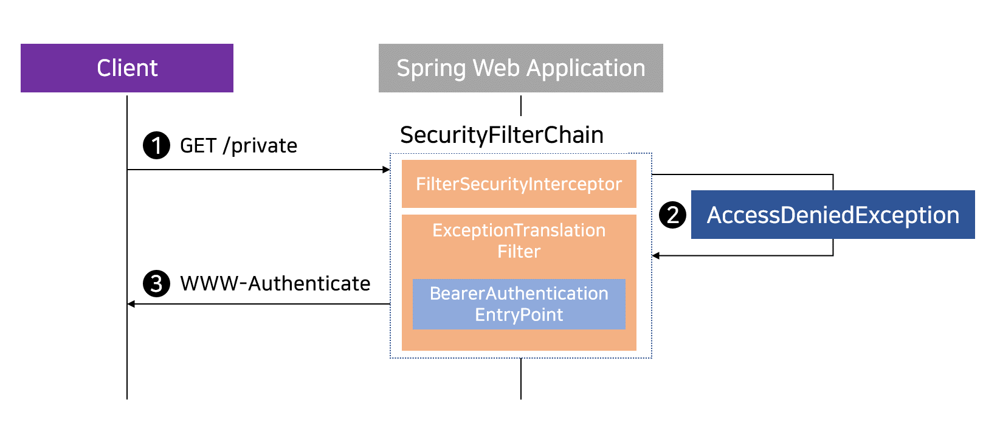
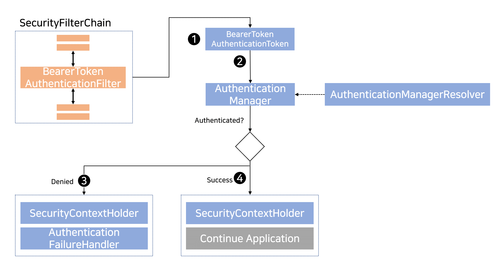

## 2021. 02. 03.

### Spring Security for Servlet - OAuth2(20)

#### OAuth 2.0 리소스 서버

Spring Security는 OAuth 2.0 [Bearer 토큰][rfc6750]의 두 가지 형태로 엔드포인트 보호를 지원한다:

* [JWT][rfc7519]
* Opaque 토큰

이는 애플리케이션이 권한 관리를 (예를 들어, Okta나 Ping Identity와 같은)[인가 서버][rfc6749]에 위임한 경우에 편리하다. 리소스 서버는 요청을 인가하기 위해 인가 서버를 찾을 수 있다.

이 섹션에서는 Spring Security가 OAuth 2.0 [Bearer 토큰][tfc6750]을 지원하는 방법에 자세히 다룬다.

> [Spring Security 저장소][spring-security-repository]에서 [JWT][jwt-sample]와 [Opaque 토큰][opaque-token-sample]이 동작하는 샘플을 볼 수 있다.

Spring Security에서 Bearer 토큰이 동작하는 방법을 살펴보자. 먼저, [Basic 인증][spring-security-basic-auth]처럼 [WWW-Authenticate][rfc7235-section4.1] 헤더가 인증되지 않은 클라이언트에게 되돌아간다.

**그림 14. WWW-Authenticate 헤더 전송**

위의 그림은 [`SecurityFilterChain`][security-filter-chain] 다이어그램을 나타낸다.

1. 먼저, 사용자는 인가되지 않은 리소스 `/private`에 대한 인증되지 않은 요청을 만든다.
2. Spring Security의 [`FilterSecurityInterceptor`][filter-security-interceptor]는 인증되지 않은 요청이 `AccessDeniedException`을 던져 *무시*(denied)되었음을 나타낸다.
3. 사용자가 인증되지 않았으므로 [`ExceptionTranslationFilter`][exception-translation-filter]는 *인증을 시작*한다. 구성된 [`AuthenticationEntryPoint`][authentication-entry-point]는 WWW-Authenticate 헤더를 보내는 [`BearerTokenAuthenticationEntryPoint`][bearer-token-authentication-entry-point]이다. 클라이언트가 최초 요청을 다시 실행할 능력이 없으므로 `RequestCache`는 주로 요청을 저장하지 않는 `NullRequestCache`이다.

클라이언트가 `WWW-Authenticate: Bearer` 헤더를 받으면, Bearer 토큰으로 재시도해야 함을 알게 된다. 아래는 Bearer 토큰이 처리되는 흐름이다.

**그림 15. Bearer 토큰 인증**

위의 그림은 [`SecurityFilterChain`][security-filter-chain] 다이어그램을 나타낸다.

1. 사용자가 자신의 Bearer 토큰을 보내면, `BearerTokenAuthenticationFilter`는 `HttpServletRequest`로부터 토큰을 추출해 [`Authentication`][authentication] 타입인 `BearerTokenAuthenticationToken`을 생성한다.
2. 다음으로, `HttpServletRequest`는 `AuthenticationManager`를 선택하는 `AuthenticationManagerResolver`로 전달된다. `BearerTokenAuthenticationToken`은 인증을 위해 `AuthenticationManager`에 전달된다. `AuthenticationManager`의 구체적인 형태는 [JWT][jwt-minimal-configuration]이나 [Opaque 토큰][opaque-token-minimal-configuration] 중 어느 것을 구성하는지에 따라 다르다.
3. 인증이 실패하면, *실패*
   * [SecurityContextHolder][security-context-holder]를 비운다. 
   * 다시 WWW-Authenticate 헤더를 보내기 위해 `AuthenticationEntryPoint`가 실행된다.
4. 인증이 성공하면, *성공*
   * [SecurityContextHolder][security-context-holder]에 [Authentication][authentication]이 설정된다.
   * `BearerTokenAuthenticationFilter`가 애플리케이션 로직의 나머지를 실행하기 위해 `FilterChain.doFilter(request, response)`를 실행한다.

[rfc6750]: https://tools.ietf.org/html/rfc6750.html
[rfc6749]: https://tools.ietf.org/html/rfc6749
[spring-security-repository]: https://github.com/spring-projects/spring-security/tree/5.4.1/samples
[jwt-sample]: https://github.com/spring-projects/spring-security/tree/5.4.1/samples/boot/oauth2resourceserver
[opaque-token-sample]: https://github.com/spring-projects/spring-security/tree/5.4.1/samples/boot/oauth2resourceserver-opaque
[spring-security-basic-auth]: https://docs.spring.io/spring-security/site/docs/5.4.1/reference/html5/#servlet-authentication-basic
[rfc7235-section4.1]: https://tools.ietf.org/html/rfc7235#section-4.1
[security-filter-chain]: https://docs.spring.io/spring-security/site/docs/5.4.1/reference/html5/#servlet-securityfilterchain
[filter-security-interceptor]: https://docs.spring.io/spring-security/site/docs/5.4.1/reference/html5/#servlet-authorization-filtersecurityinterceptor
[exception-translation-filter]: https://docs.spring.io/spring-security/site/docs/5.4.1/reference/html5/#servlet-exceptiontranslationfilter
[authentication-entry-point]: https://docs.spring.io/spring-security/site/docs/5.4.1/reference/html5/#servlet-authentication-authenticationentrypoint
[bearer-token-authentication-entry-point]: https://docs.spring.io/spring-security/site/docs/current/api/org/springframework/security/oauth2/server/resource/authentication/BearerTokenAuthenticationEntryPoint.html
[authentication]: https://docs.spring.io/spring-security/site/docs/5.4.1/reference/html5/#servlet-authentication-authentication
[jwt-minimal-configuration]: https://docs.spring.io/spring-security/site/docs/5.4.1/reference/html5/#oauth2resourceserver-jwt-minimalconfiguration
[opaque-token-minimal-configuration]: https://docs.spring.io/spring-security/site/docs/5.4.1/reference/html5/#oauth2resourceserver-opaque-minimalconfiguration
[security-context-holder]: https://docs.spring.io/spring-security/site/docs/5.4.1/reference/html5/#servlet-authentication-securitycontextholder