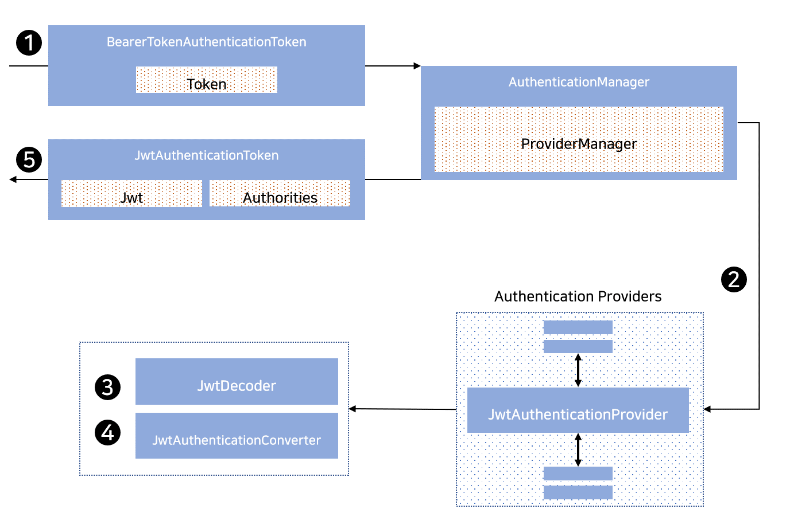

## 2021. 02. 06.

### Spring Security for Servlet - OAuth2(23)

#### OAuth 2.0 리소스 서버 - JWT 인증의 동작 방식

서블릿 기반 애플리케이션에서 Spring Boot가 [JWT][rfc7519] 인증을 지원하는 데 사용하는 아키텍처 구성요소에 대해 알아보자.

[`jwtAuthenticationProvider`][jwt-auithentication-provider]는 [`JwtDecoder`][jwt-decoder]와 [`JwtAuthenticationConvrter`][jwt-authentication-converter]를 활용해 JWT를 인증하는 [`AuthenticationProvider`][authentication-provider] 구현체이다. 

`JwtAuthenticationProvider`가 Spring Boot에서 어떻게 동작하는지 살펴보자. 아래 그림은 [Bearer 토큰 읽기][reading-bearer-token]의 도식에서 [`AuthenticationManager`][authentication-manager]의 세부 동작 방식을 나타낸다.

**그림 16. `JwtAuthenticationProvider` 사용**

1. [Bearer 토큰 읽기][reading-bearer-token]에서 인증 `Filter`가 `BearerTokenAuthenticationToken`을 [`ProviderManager`][provider-manager]에 의해 구현된 `AuthenticationManager`로 전달한다.
2. `ProviderManager`는 `JwtAuthenticationProvider` 타입의 [`AuthenticationProvider`][authentication-provider]를 사용하도록 구성된다.
3. `JwtAuthenticationProvider`는 [`JwtDecoder`][jwt-decoder]를 사용해 `Jwt`를 디코드, 확인(verify), 검증(validate)한다.
4. `JwtAuthenticationProvider`는 그 다음 [`JwtAuthenticationConverter`][jwt-authentication-converter]를 사용해 `Jwt`를 승인된 권한의 `Collection`으로 변환한다.
5. 인증이 성공하면 `JwtAuthenticationToken` 타입의 [`Authentication`][authentication]이 반환되며, 주체(principal)는 구성된 `JwtDecoder`가 반환한 `Jwt`를 갖는다. 궁극적으로, 반환되는 `JwtAuthenticationToken`은 인증 `Filter`가 [`SecurityContextHolder`][security-context-holder]에 설정한다.

[rfc7519]: https://tools.ietf.org/html/rfc7519
[jwt-auithentication-provider]: https://docs.spring.io/spring-security/site/docs/current/api/org/springframework/security/oauth2/server/resource/authentication/JwtAuthenticationProvider.html
[authentication-provider]: https://docs.spring.io/spring-security/site/docs/5.4.1/reference/html5/#servlet-authentication-authenticationprovider
[jwt-decoder]: https://docs.spring.io/spring-security/site/docs/5.4.1/reference/html5/#oauth2resourceserver-jwt-decoder
[jwt-authentication-converter]: https://docs.spring.io/spring-security/site/docs/5.4.1/reference/html5/#oauth2resourceserver-jwt-authorization-extraction
[reading-bearer-token]: https://docs.spring.io/spring-security/site/docs/5.4.1/reference/html5/#oauth2resourceserver-authentication-bearertokenauthenticationfilter
[authentication-manager]: https://docs.spring.io/spring-security/site/docs/5.4.1/reference/html5/#servlet-authentication-authenticationmanager
[provider-manager]: https://docs.spring.io/spring-security/site/docs/5.4.1/reference/html5/#servlet-authentication-providermanager
[authentication]: https://docs.spring.io/spring-security/site/docs/5.4.1/reference/html5/#servlet-authentication-authentication
[security-context-holder]: https://docs.spring.io/spring-security/site/docs/5.4.1/reference/html5/#servlet-authentication-securitycontextholder