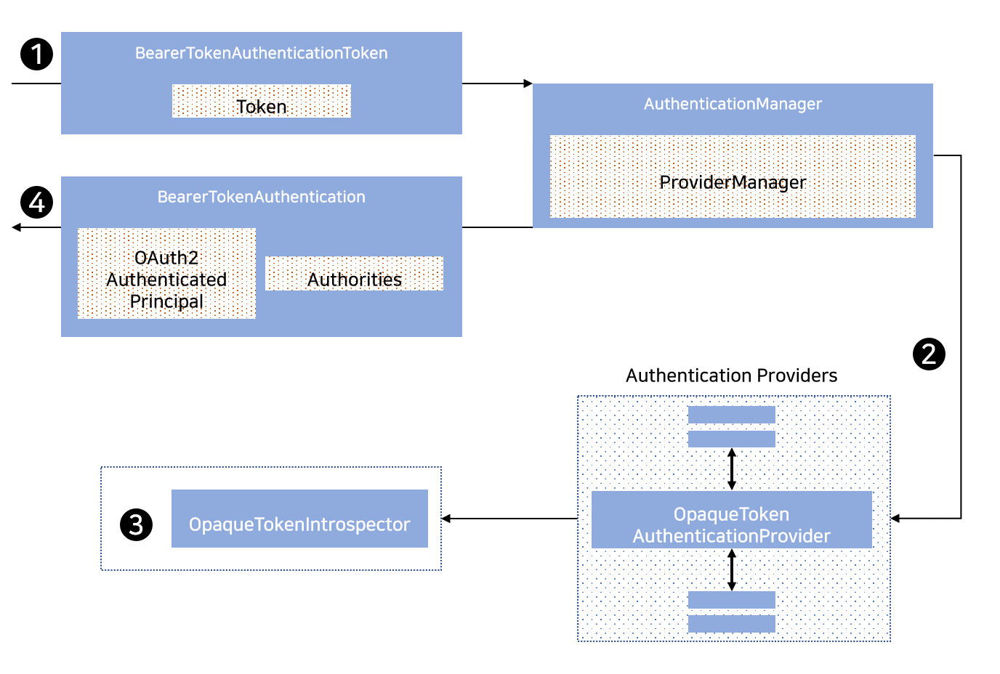

## 2021. 02. 17.

### Spring Security for Servlet - OAuth2(33)

#### OAuth 2.0 리소스 서버 - Opaque 토큰 인증의 동작 방식

Spring Security가 서블릿 기반 환경에서 [Opaque 토큰][rfc-7662] 인증을 지원하기 위해 사용하는 아키텍처상의 구성 요소들을 살펴보자.

[`OpaqueTokenAuthenticationProvider`][opaquetokenauthenticationprovider]는 opaque 토큰 인증을 위해 [`OpaqueTokenIntrospector`][opaquetokenintrospector]를 활용하는 [`AuthenticationProvider`][authenticationprovider] 구현체이다.

`OpaqueTokenAuthenticationProvider`가 Spring Security에서 어떻게 동작하는지 알아보자. 아래 그림은 [Bearer 토큰 읽기][reading-bearer-token] 그림에서 [`AuthenticationManager`][authenticationmanager]의 세부적인 동작 방식을 설명한다.

*그림 17. `OpaqueTokenAuthenticationProvider` 사용*

1. [Bearer 토큰 읽기][reading-bearer-token]에서 인증 `Filter`는 `BearerTokenAuthenticationToken`을 [`ProviderManager`][provider-manager] 구현체인 `AuthenticationManager`에게 전달한다.
2. `ProviderManager`는 `OpaqueTokenAuthenticationProvider` 타입의 [`AuthenticationProvider`][authenticationprovider]를 사용하도록 구성된다.
3. `OpaqueTokenAuthenticationProvider`는 [`OpaqueTokenIntrospector`][opaquetokenintrospector]를 사용해 opaque 토큰을 확인(introspect)하고 허용된 권한들을 추가한다. 인증이 성공하면 `BearerTokenAuthentication` 타입의 [`Authentication`][authentication]이 반환되고 구성된 [`OpaqueTokenIntrospector`][opaquetokenintrospector]가 반환한 `OAuth2AuthenticatedPrincipal`을 주체로 갖는다. 궁극적으로 반환된 `BearerTokenAuthentication`은 인증 `Filter`에 의해 [`SecurityContextHolder`][securitycontextholder]에 설정된다.

[rfc-7662]: https://tools.ietf.org/html/rfc7662
[opaquetokenauthenticationprovider]: https://docs.spring.io/spring-security/site/docs/current/api/org/springframework/security/oauth2/server/resource/authentication/OpaqueTokenAuthenticationProvider.html
[opaquetokenintrospector]: https://docs.spring.io/spring-security/site/docs/5.4.1/reference/html5/#oauth2resourceserver-opaque-introspector
[authenticationprovider]: https://docs.spring.io/spring-security/site/docs/5.4.1/reference/html5/#servlet-authentication-authenticationprovider
[authenticationmanager]: https://docs.spring.io/spring-security/site/docs/5.4.1/reference/html5/#servlet-authentication-authenticationmanager
[reading-bearer-token]: https://docs.spring.io/spring-security/site/docs/5.4.1/reference/html5/#oauth2resourceserver-authentication-bearertokenauthenticationfilter
[provider-manager]: https://docs.spring.io/spring-security/site/docs/5.4.1/reference/html5/#servlet-authentication-providermanager
[securitycontextholder]: https://docs.spring.io/spring-security/site/docs/5.4.1/reference/html5/#servlet-authentication-securitycontextholder