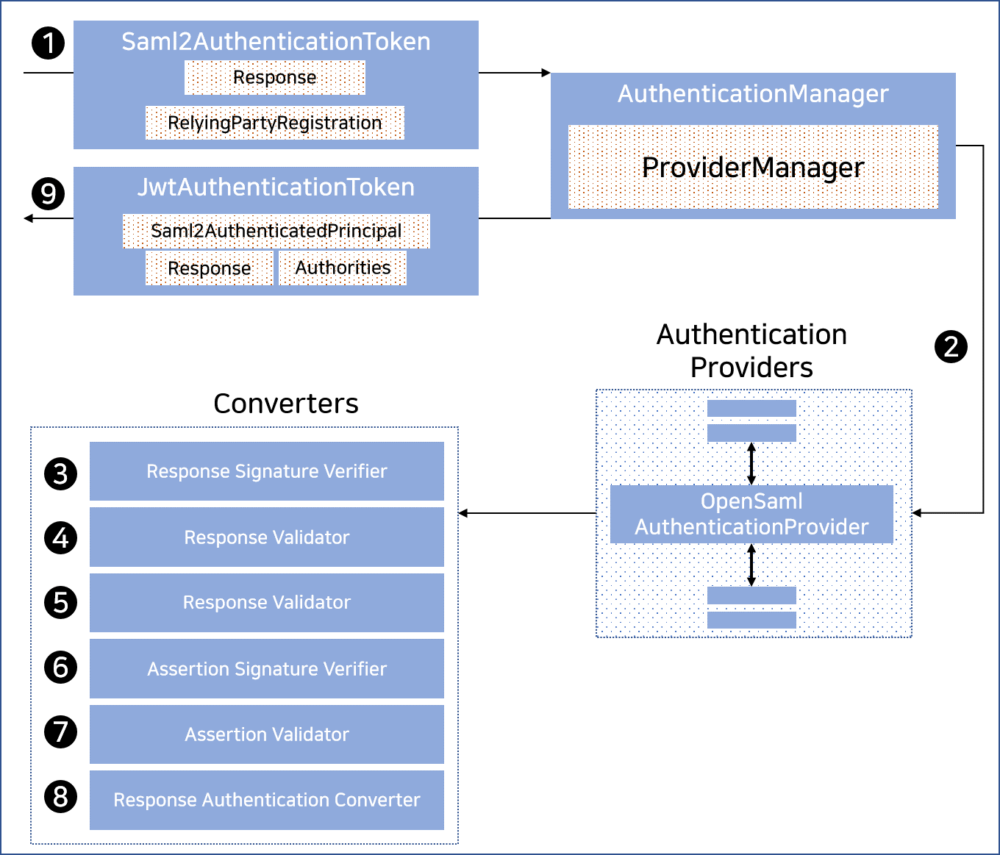

## 2021. 03. 04.

### Spring Security for Servlet - SAML2(4)

#### SAML 2.0  로그인 - OpenSAML을 활용한 SAML 2.0 로그인 통합

Spring Security의 SAML 2.0 지원은 두 가지 설계 목표를 갖는다:

* 첫 번째, SAML 2.0 연산과 도메인 객체를 위한 라이브러리에 의존한다. Spring Security는 OpenSAML을 사용한다.
* 두 번째, Spring Security의 SAML 지원을 사용하지 않을 때는 필요로 하지 않는다. 이를 위해 Spring Security가 계약(contract)에서 OpenSAML을 사용하는 인터페이스나 클래스는 캡슐화하여 유지한다. 이는 OpenSAML을 다른 라이브러리나 지원되지 않는 OpenSAML 버전으로도 전환할 수 있도록 한다.

위의 두 목표로부터 자연스러운 결과로, Spring Security의 SAML API는 다른 모듈과 상당히 적은 관계를 갖는다. 대신 `OpenSamlAuthenticationRequestFactory`와 `OpenSamlAuthenticationProvider`는 인증 과정의 여러 단계를 커스터마이즈하는 `Converter`를 노출한다.

예를 들어, 애플리케이션이 `SAMLResponse`를 받아 `Saml2WebSsoAuthenticationFilter`로 위임하면, 필터는 `OpenSamlAuthenticationProvider`로 위임할 것이다.

**OpenSAML `Response` 인증**



위 그림은 [`Saml2WebSsoAuthenticationFilter` 다이어그램][saml-2-web-sso-authentication-filter]을 나타낸다

1. `Saml2WebSsoAuthenticationFilter`는 `Saml2AuthenticationToken`을 만들어 [`AuthenticationManager`][authentication-manager]를 호출한다.
2. [`AuthenticationManager`][authentication-manager]는 `OpenSamlAuthenticationProvider`를 호출한다.
3. 인증 제공자는 응답을 OpenSAML `Response`로 역직렬화하여 시그니처를 확인한다. 시그니처가 유효하지 않으면 인증은 실패한다.
4. 다음으로 제공자는 응답의 `Issuer`와 `Destination` 값의 유효성을 확인한다. `RelyingPartyRegistration`에 있는 것과 일치하지 않으면 인증은 실패한다.
5. 이후 제공자는 암호화된 어서션을 복호화한다. 복호화에 실패하면 인증은 실패한다.
6. 그 다음, 제공자는 각 `Assertion`의 시그니처를 확인한다. 유효하지 않은 시그니처가 있으면 인증은 실패한다. 또한 응답이나 어서션 중 어느 쪽에도 시그니처가 없으면 인증은 실패한다. 응답이나 어서션 중 하나는 시그니처를 가져야 한다.
7. 이후에 제공자는 각 어서션의 `ExpiresAt`과 `NotBefore` 타임스탬프와 `<Subject>`와 `<AudienceRestriction>` 조건의 유효성을 확인한다. 유효성 검증에 실패하면 인증은 실패한다.
8. 그 뒤에 제공자는 첫 번째 어서션의 `AttributeStatement`를 `Map<String, List<Object>>`로 매핑한다. 또한 `ROLE_USER` 권한도 허용한다.
9. 마지막으로, 첫 번째 어서션의 `NameID`, 속성의 `Map`, `GrantedAuthority`로 `Saml2AuthenticatedPrincipal`을 생성한다. 그 다음 주체와 권한을 `Saml2Authentication`에 넣는다.

결과인 `Authentication#getPrincipal`은 Spring Security `Saml2AuthenticatedPrincipal` 객체이고, `Authentication#getName`은 첫 번째 어서션의 `NameID` 원소와 매핑한다.

##### OpenSAML 구성 커스터마이즈

Spring Security와 OpenSAML 둘 다 사용하는 클래스는 다음과 같이 클래스의 시작에서 `OpenSamlInitializationService`를 정적으로 초기화해야 한다:

```java
static {
    OpenSamlInitializationService.initialize();
}
```

이는 OpenSAML의 `InitializationService#initialize`를 대체한다.

가끔 OpenSAML이 SAML 객체를 생성, 마샬(marshall), 언마샬(unmarshall)하는 방법를 커스터마이즈하면 유용할 때가 있다. 이런 경우 OpenSAML의 `XMLObjectProviderFactory`에 접근할 수 있는 `OpenSamlInitializationService#requireInitialize(Consumer)`를 호춣한다.

예를 들어, 항상 어서션 당사자가 사용자를 재인증하길 원하는 경우 `AuthnRequestMarshaller`를 다음과 같이 등록한다:

```java
static {
    OpenSamlInitializationService.requireInitialize(factory -> {
        AuthnRequestMarshaller marshaller = new AuthnRequestMarshaller() {
            @Override
            public Element marshall(XMLObject object, Element element) throws MarshallingException {
                configureAuthnRequest((AuthnRequest) object);
                return super.marshall(object, element);
            }

            public Element marshall(XMLObject object, Document document) throws MarshallingException {
                configureAuthnRequest((AuthnRequest) object);
                return super.marshall(object, element);
            }

            private void configureAuthnRequest(AuthnRequest authnRequest) {
                authnRequest.setForceAuthN(true);
            }
        }
    });
}
```

`requireInitialize` 메서드는 애플리케이션 인스턴스에서 딱 한번만 호출된다.


[saml-2-web-sso-authentication-filter]: https://docs.spring.io/spring-security/site/docs/5.4.1/reference/html5/#servlet-saml2login-authentication-saml2webssoauthenticationfilter
[authentication-manager]: https://docs.spring.io/spring-security/site/docs/5.4.1/reference/html5/#servlet-authentication-providermanager