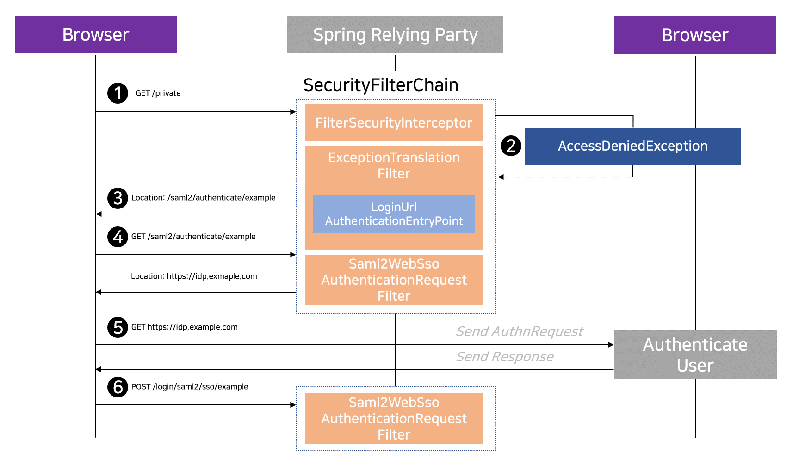
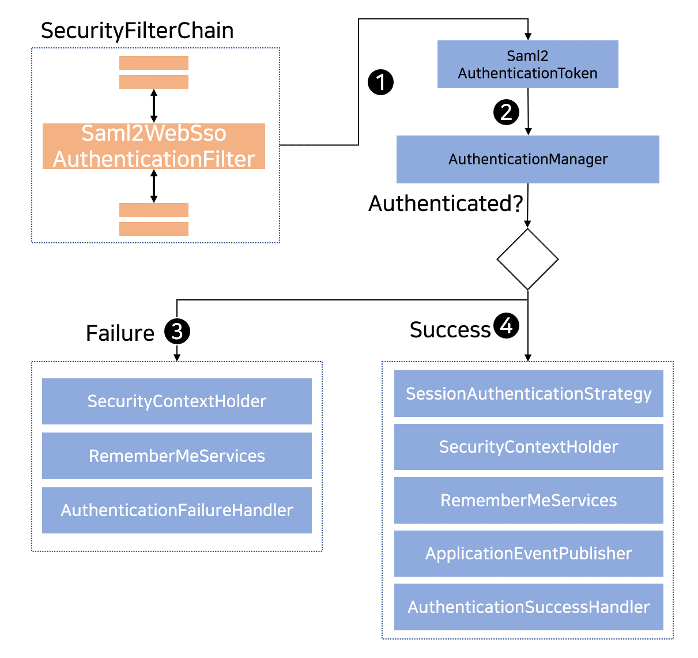

## 2021. 03. 01.

### Spring Security for Servlet - SAML2(1)

#### SAML 2.0  로그인

SAML 2.0 로그인 기능은 사용자들이 SAML 2.0 어서션 당사자(asserting party, e.g. Okta, ADFS, etc)에 이미 등록된 계정을 이용해 애플리케이션에 [로그인][flow-and-config]할 수 있도록, 애플리케이션이 SAML 2.0 신뢰 당사자(relying party)로 동작하는 기능을 제공한다.

> SAML 2.0 로그인은 [SAML 2 프로파일][saml2-profiles]에 명시된 대로 웹 브라우저 SSO 프로파일을 사용해 구현되었다. 

2009년부터 신뢰 당자사에 대한 지원은 [확장 프로젝트][spring-saml] 형태로 존재했었다. 2019년에 이를 [Spring Security][spring-security]로 이식하는 프로세스가 시작됐다. 이 프로세스는 2017년에 시작된 [Spring Security의 OAuth 2.0 지원][spring-security-oauth2]에 대한 프로세스와 비슷하다.

> [SAML 2.0 로그인][saml-login]을 사용하는 샘플은 [Spring Security 저장소][spring-security-repo]에서 확인할 수 있다.

Spring Security에서 SAML 2.0 신뢰 당사자 인증이 동작하는 방식을 살펴보자. 먼저, [OAuth 2.0  로그인][oauth2-login]과 비슷하게, Spring Security는 인증을 수행하기 위해 사용자를 제삼자에게 안내한다. 이는 여러 리다이렉트를 거친다.

*그림 18. 어서션 당사자 인증 리다이렉션*

위의 그림은 [`SecurityFilterChain`][security-filter-chain]과 [AbstractAuthenticationProcessingFilter][abstract-authentication-proecessing-filter] 다이어그램을 나타낸다.

1. 먼저, 사용자는 인가받지 않은 리소스 `/private`에 대한 인증되지 않은 요청을 보낸다.
2. Spring Security의 [`FilterSecurityInterceptor`][filter-security-interceptor]는 `AccessDeniedException`을 던져 인증되지 않은 요청이 거부되었음을 나타낸다.
3. 사용자는 인가가 없으므로 [`ExceptionTranslationFilter`][exception-translation-filter]는 *인증을 시작*한다. 구성된 [`AuthenticationEntryPoint`][authentication-entry-point]는 [`LoginUrlAuthenticationEntryPoint` ][login-url-authentication-entry-point] 타입의 인스턴스로, [`<saml2:AuthnRequest>` 생성 엔드포인트][saml2-login-sp-initiate-factory]인 `Saml2WebSsoAuthenticationRequestFilter`로 리다이렉트한다. 혹은 [둘 이상의 어서션 당사자를 구성][saml2-login-relying-party-registration-repository]한 경우 선택 페이지로 리다이렉트할 것이다.
4. 다음으로 `Saml2WebSsoAuthenticationRequestFilter`는 구성된 [`Saml2AuthenticationRequestFactory`][saml2-authentication-request-factory]를 사용해  `<saml2.AuthnRequest>`를 생성, 서명, 직렬화 및 인코딩한다.
5. 그 후, 브라우저는 이 `<saml2:AuthnRequest>`를 어서션 당사자에게 제시한다. 어서션 당사자는 사용자 인증을 시도한다. 성공하면 브라우저로 `<saml2:Response>`를 반환할 것이다.
6. 브라우저는 이후 어서션 소비자 서비스 엔드포인트로 `<saml2:Response>`를 POST한다.

*그림 19. `<saml2:Response>` 인증*

위의 그림은 [`SecurityFilterChain`][security-filter-chain] 다이어그램을 나타낸다.

1. 브라우저가 애플리케이션으로 `<saml2:Response>`를 보내면 이를 [`Saml2WebSsoAuthenticationFilter`로 위임한다][saml2-login-authenticate-response]. 이 필터는 `HttpServletRequest`로부터 응답을 추출하여 `Saml2AuthenticationToken`을 생성하기 위해 자신에게 구성된 `AuthenticationConverter`를 호출한다. 이 컨버터는 추가로 [`RelyingPartyRegistration`][relying-party-registration]을 리졸브하고 이를 `Saml2AuthenticationToken`에 제공한다.
2. 다음으로, 필터는 토큰을 자신에게 구성된 [`AuthenticationManager`][authentication-manager]에게 전달한다. 기본값으로는 [`OpenSamlAuthenticationProvider`][open-saml-authentication-provider]를 사용할 것이다.
3. 인증이 실패하면, *실패*
   * [`SecurityContextHolder`][security-context-holder]를 비운다.
   * 인증 프로세스를 재시작하기 위해 [`AuthenticationEntryPoint`][authentication-entry-point]가 호출된다.
4. 인증이 성공하면, *성공*
   * [`Authentication`][authentication]을 [`SecurityContextHolder`][security-context-holder]에 설정한다.
   * `Saml2WebSsoAuthenticationFilter`는 나머지 애플리케이션 로직을 계속하기 위해 `FilterChain#doFilter(request,response)`를 호출한다.

[flow-and-config]: https://wiki.shibboleth.net/confluence/display/CONCEPT/FlowsAndConfig
[saml2-profiles]: https://www.oasis-open.org/committees/download.php/35389/sstc-saml-profiles-errata-2.0-wd-06-diff.pdf#page=15
[spring-saml]: https://github.com/spring-projects/spring-security-saml/tree/1e013b07a7772defd6a26fcfae187c9bf661ee8f#spring-saml
[spring-security]: https://github.com/spring-projects/spring-security
[spring-security-oauth2]: https://docs.spring.io/spring-security/site/docs/5.4.1/reference/html5/#oauth2
[saml-login]: https://github.com/spring-projects/spring-security/tree/5.4.1/samples/boot/saml2login
[spring-security-repo]: https://github.com/spring-projects/spring-security/tree/5.4.1/samples
[oauth2-login]: https://docs.spring.io/spring-security/site/docs/5.4.1/reference/html5/#oauth2login
[security-filter-chain]: https://docs.spring.io/spring-security/site/docs/5.4.1/reference/html5/#servlet-securityfilterchain
[abstract-authentication-proecessing-filter]: https://docs.spring.io/spring-security/site/docs/5.4.1/reference/html5/#servlet-authentication-abstractprocessingfilter
[filter-security-interceptor]: https://docs.spring.io/spring-security/site/docs/5.4.1/reference/html5/#servlet-authorization-filtersecurityinterceptor
[exception-translation-filter]: https://docs.spring.io/spring-security/site/docs/5.4.1/reference/html5/#servlet-exceptiontranslationfilter
[authentication-entry-point]: https://docs.spring.io/spring-security/site/docs/5.4.1/reference/html5/#servlet-authentication-authenticationentrypoint
[login-url-authentication-entry-point]: https://docs.spring.io/spring-security/site/docs/current/api/org/springframework/security/web/authentication/LoginUrlAuthenticationEntryPoint.html
[saml2-login-sp-initiate-factory]: https://docs.spring.io/spring-security/site/docs/5.4.1/reference/html5/#servlet-saml2login-sp-initiated-factory
[saml2-login-relying-party-registration-repository]: https://docs.spring.io/spring-security/site/docs/5.4.1/reference/html5/#servlet-saml2login-relyingpartyregistrationrepository
[saml2-authentication-request-factory]: https://docs.spring.io/spring-security/site/docs/5.4.1/reference/html5/#servlet-saml2login-sp-initiated-factory
[saml2-login-authenticate-response]: https://docs.spring.io/spring-security/site/docs/5.4.1/reference/html5/#servlet-saml2login-authenticate-responses
[relying-party-registration]: https://docs.spring.io/spring-security/site/docs/5.4.1/reference/html5/#servlet-saml2login-relyingpartyregistration
[authentication-manager]: https://docs.spring.io/spring-security/site/docs/5.4.1/reference/html5/#servlet-authentication-providermanager
[open-saml-authentication-provider]: https://docs.spring.io/spring-security/site/docs/5.4.1/reference/html5/#servlet-saml2login-architecture
[security-context-holder]: https://docs.spring.io/spring-security/site/docs/5.4.1/reference/html5/#servlet-authentication-securitycontextholder
[authentication]: https://docs.spring.io/spring-security/site/docs/5.4.1/reference/html5/#servlet-authentication-authentication