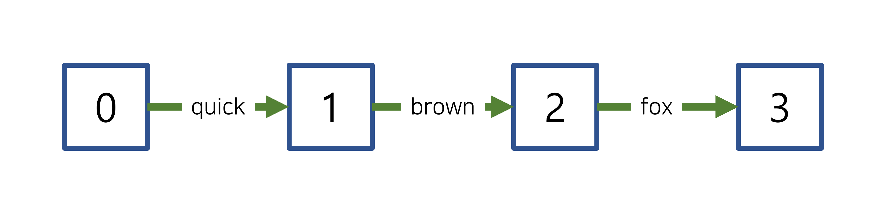

# 2022. 08. 24.

## Elasticsearch(7.10)

### 텍스트 분석 - 텍스트 분석 개념

#### 토큰 그래프

[토큰화기][tokenizer]가 텍스트를 토큰 스트림으로 변환할 때 아래 내용도 함께 기록한다:

* 스트림에서 각 토큰의 `position`
* 토큰이 차지하는 position의 개수인 `positionLength`

이들을 사용해 *토큰 그래프*라 부르는 스트림에 대한 [유향 비순환 그래프(directed acyclic graph)][wikipedia-dag]를 만들 수 있다. 토큰 그래프에서는 각 위치가 노드를 나타낸다. 각 토큰은 다음 위치를 가리키는 간선(edge 혹은 arc)를 나타낸다.

[tokenizer]: https://www.elastic.co/guide/en/elasticsearch/reference/7.10/analyzer-anatomy.html#analyzer-anatomy-tokenizer
[wikipedia-dag]: https://en.wikipedia.org/wiki/Directed_acyclic_graph