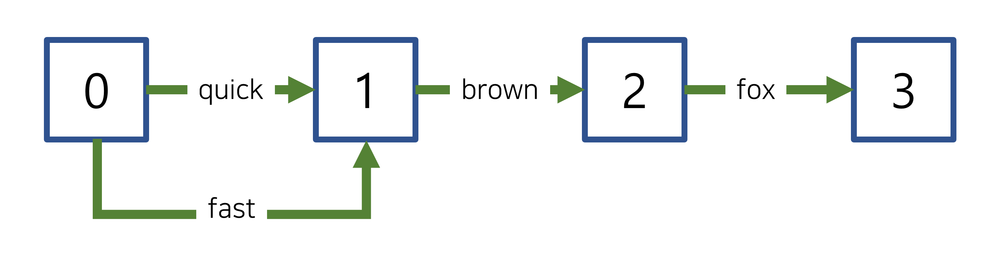

# 2022. 08. 25.

## Elasticsearch(7.10)

### 텍스트 분석 - 텍스트 분석 개념

#### 토큰 그래프

##### 동의어(synonyms)

일부 [토큰 필터][token-filters]는 기존 토큰 스트림에 동의어 같은 새 토큰을 추가할 수 있다. 이런 동의어들은 기존 토큰과 동일한 위치를 차지한다.

다음 그래프에서, `quick`과 동의어 `fast`는 `0`의 위치를 갖는다. 둘은 같은 위치를 차지한다.

[token-filters]: https://www.elastic.co/guide/en/elasticsearch/reference/7.10/analyzer-anatomy.html#analyzer-anatomy-token-filters