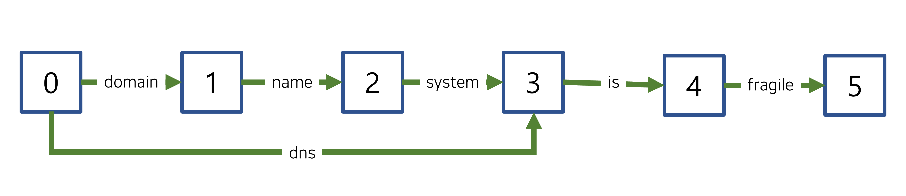

# 2022. 08. 26.

## Elasticsearch(7.10)

### 텍스트 분석 - 텍스트 분석 개념

#### 토큰 그래프

##### 다중 위치 토큰

일부 토큰 필터는 여러 위치를 차지하는 토큰을 추가할 수 있다. 여기에는 "automatic teller machine"에 대한 동의어로 "atm"을 사용하는 것과 같은 다중 단어 동의어에 대한 토큰도 포함된다.

하지만, *그래프 토큰 필터*로 알려진 오직 일부 토큰 필터만이 정확하게 다중 위치 토큰에 대한 `positionLength`를 기록한다. 여기에는 다음 필터가 포함된다:

* [`synonym_graph`](https://www.elastic.co/guide/en/elasticsearch/reference/7.10/analysis-synonym-graph-tokenfilter.html)
* [`word_delimiter_graph`](https://www.elastic.co/guide/en/elasticsearch/reference/7.10/analysis-word-delimiter-graph-tokenfilter.html)

[`nori_tokenizer`][nori-tokenizer]와 같은 일부 토큰화기도 복합 토큰을 다중 위치 토큰으로 정확하게 분리할 수 있다.

다음 그래프에서 `domain name system`과 그 동의어인 `dns`는 모두 위치 `0`을 갖는다. 하지만 `dns`는 `3`의 `positionLength`를 갖는다. 그래프의 다른 토큰들은 기본 `positionLength`인 `1`을 갖는다.



###### 검색에 토큰 그래프 사용

[인덱싱][analysis-index-search-time]은 `positionLength` 속성을 무시하고 다중 위치 토큰을 가진 토큰 그래프를 지원하지 않는다.

하지만, [`match`][match-query]나 [`match_phrase`][match-phrase-query] 쿼리와 같은 쿼리들은 이 그래프를 사용해 단일 쿼리 문자열로부터 여러 서브 쿼리를 생성할 수 있다.

**예시**

사용자가 `match_phrase` 쿼리를 사용해 다음 구절을 검색한다고 하자:

`domain name system is fragile`

[검색 분석][analysis-index-search-time]에서 `domain name system`에 대한 동의어인 `dns`가 쿼리 문자열의 토큰 스트림에 추가된다. `dns` 토큰은 `3`의 `positionLength`를 갖는다.


이 `match_phrase` 쿼리는 이 그래프를 사용해 다음 구절에 대한 서브 쿼리를 생성한다:

```
dns is fragile
domain name system is fragile
```

즉, 쿼리가 `dns is fragile` *이나* `domain name system is fragile` 중 어느 것을 가진 도큐먼트와도 일치한다.


[nori-tokenizer]: https://www.elastic.co/guide/en/elasticsearch/plugins/7.10/analysis-nori-tokenizer.html
[analysis-index-search-time]: https://www.elastic.co/guide/en/elasticsearch/reference/7.10/analysis-index-search-time.html
[match-query]: https://www.elastic.co/guide/en/elasticsearch/reference/7.10/query-dsl-match-query.html
[match-phrase-query]: https://www.elastic.co/guide/en/elasticsearch/reference/7.10/query-dsl-match-query-phrase.html