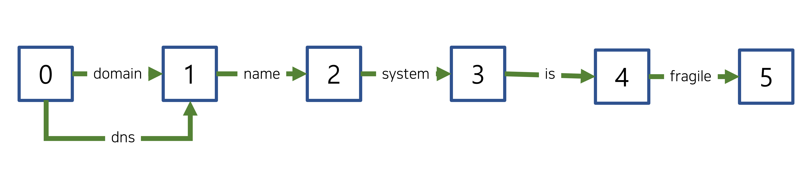

# 2022. 08. 27.

## Elasticsearch(7.10)

### 텍스트 분석 - 텍스트 분석 개념

#### 토큰 그래프

#### 유효하지 않은 토큰 그래프

다음 토큰 필터는 여러 위치를 차지하는 토큰을 추가하지만 기본 `positionLength`인 `1`만 기록한다:

- [`synonym`](https://www.elastic.co/guide/en/elasticsearch/reference/7.10/analysis-synonym-tokenfilter.html)
- [`word_delimiter`](https://www.elastic.co/guide/en/elasticsearch/reference/7.10/analysis-word-delimiter-tokenfilter.html)

즉, 이 필터들은 이러한 토큰을 포함하는 스트림에 대해 유효하지 않은 토큰 그래프를 생성한다.

다음 그래프에서 `dns`는 `domain name system`에 대한 다중 위치 동의어이다. 하지만 `dns`는 기본 `positionLength` 값인 `1`을 갖고, 결과적으로 유효하지 않은 그래프가 된다.

유효하지 않은 토큰 그래프를 검색에 사용하는 것을 피하라. 유효하지 않은 그래프는 기대하지 않은 검색 결과를 낼 수 있다.