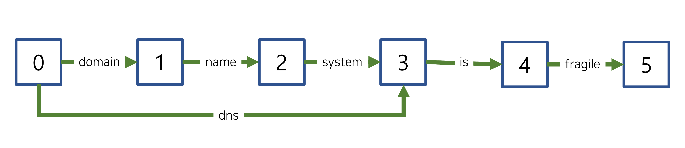
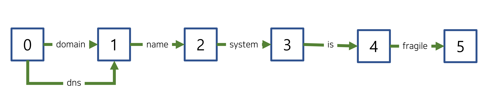

# 2022. 10. 21.

## Elasticsearch(7.10)

### 텍스트 분석 - 토큰 필터 레퍼런스

#### Flatten graph 토큰 필터

[`synonym_graph`][synonym-graph-token-filter]나 [`word_delimiter_graph`][word-delimiter-graph-token-filter]와 같은 그래프 토큰 필터에서 만들어진 [토큰 그래프][token-graph]를 평탄화(flatten)한다.

[다중 위치 토큰][multi-position-token](mult-position tokens)을 가진 토큰 그래프를 평탄화해 그래프를 [인덱싱][analysis-index-search-time]에 적합하게 만든다.

> 그래프를 평탄화는 손실(lossy) 과정이다.
>
> 가능하면 `flatten_graph` 필터 사용을 피하라. 대신, 그래프 토큰 필터를 [검색 분석기][analysis-index-search-time]에만 사용하라. `flatten_graph` 필터의 필요성을 제거한다.

`flatten_graph` 필터는 Lucene의 [FlattenGraphFilter][lucene-flatten-graph-filter]를 사용한다.

##### 예제

`flatten_graph` 필터의 동작 방법을 살펴보려면 다중 위치 토큰을 갖는 토큰 그래프를 만들어야 한다.

다음 [분석 API][analyze-api] 요청은 `synoym_graph` 필터를 사용해 텍스트 `domain name system is fragile`에서 `dns`를 `domain name system`에 대한 다중 위치 동의어로 추가한다:

```http
GET /_analyze
{
  "tokenizer": "standard",
  "filter": [
    {
      "type": "synonym_graph",
      "synonyms": [ "dns, domain name system" ]
    }
  ],
  "text": "domain name system is fragile"
}
```

필터는 `dns`를 다중 위치 토큰으로 하여 다음 토큰 그래프를 만들어낸다.



인덱싱은 다중 위치 토큰을 가진 토큰 그래프를 지원하지 않는다. 이 토큰 그래프를 인덱싱에 적합하게 만들기 위해서는 평탄화해야 한다.

토큰 그래프를 평탄화하려면 앞의 분석 API 요청에서 `flatten_graph` 필터를 `synonym_graph` 필터 다음에 추가한다.

```http
GET /_analyze
{
  "tokenizer": "standard",
  "filter": [
    {
      "type": "synonym_graph",
      "synonyms": [ "dns, domain name system" ]
    },
    "flatten_graph"
  ],
  "text": "domain name system is fragile"
}
```

이 필터는 다음과 같이 평탄화돼 인덱싱에 적합한 토큰 그래프를 만들어낸다.



##### 분석기에 추가

다음 [인덱스 생성 API][create-index-api] 요청은 `flatten_graph` 토큰 필터를 사용해 새 [커스텀 분석기][custom-analyzer]를 구성한다.

이 분석기에서는 `word_delimiter_graph` 필터가 다중 위치 토큰들이 연결된 토큰 그래프를 만들어낸다. `flatten_graph` 필터는 이 토큰 그래프를 평탄화해 인덱싱에 적합하도록 만든다.

```http
PUT /my-index-000001
{
  "settings": {
    "analysis": {
      "analyzer": {
        "my_custom_index_analyzer": {
          "type": "custom",
          "tokenizer": "standard",
          "filter": [
            "my_custom_word_delimiter_graph_filter",
            "flatten_graph"
          ]
        }
      },
      "filter": {
        "my_custom_word_delimiter_graph_filter": {
          "type": "word_delimiter_graph",
          "catenate_all": true
        }
      }
    }
  }
}
```


[synonym-graph-token-filter]: https://www.elastic.co/guide/en/elasticsearch/reference/7.10/analysis-synonym-graph-tokenfilter.html
[word-delimiter-graph-token-filter]: https://www.elastic.co/guide/en/elasticsearch/reference/7.10/analysis-word-delimiter-graph-tokenfilter.html
[token-graph]: https://www.elastic.co/guide/en/elasticsearch/reference/7.10/token-graphs.html
[multi-position-token]: https://www.elastic.co/guide/en/elasticsearch/reference/7.10/token-graphs.html#token-graphs-multi-position-tokens
[analysis-index-search-time]: https://www.elastic.co/guide/en/elasticsearch/reference/7.10/analysis-index-search-time.html
[lucene-flatten-graph-filter]: https://lucene.apache.org/core/8_7_0/analyzers-common/org/apache/lucene/analysis/core/FlattenGraphFilter.html
[analyze-api]: https://www.elastic.co/guide/en/elasticsearch/reference/7.10/indices-analyze.html
[create-index-api]: https://www.elastic.co/guide/en/elasticsearch/reference/7.10/indices-create-index.html
[custom-analyzer]: https://www.elastic.co/guide/en/elasticsearch/reference/7.10/analysis-custom-analyzer.html