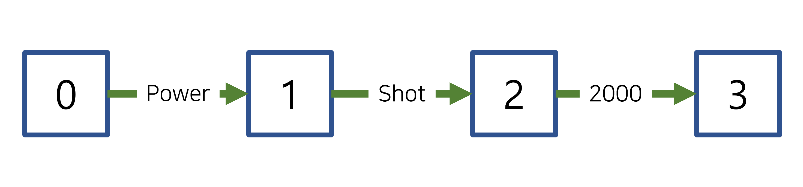
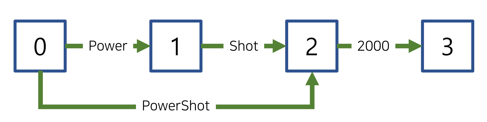
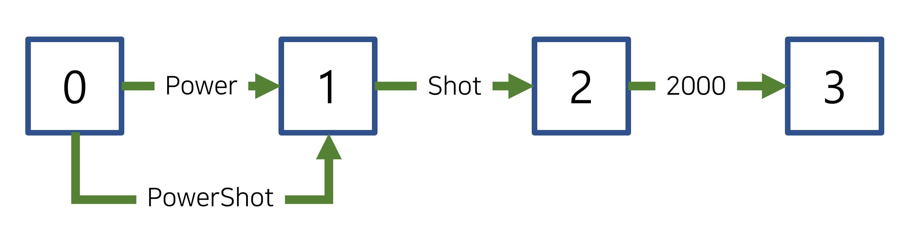

# 2022. 11. 27.

## Elasticsearch(7.10)

### 텍스트 분석 - 토큰 필터 레퍼런스

#### Word delimiter graph 토큰 필터

토큰을 알파벳/숫자가 아닌 문자에서 나눈다. `word_delimiter_graph` 필터는 선택적으로 규칙에 따라 토큰 정규화를 수행한다. 기본적으로, 필터는 다음 규칙을 사용한다.

* 토큰을 알파벳과 숫자가 아닌 문자마다 나눈다. 필터는 이 문자들을 구분자로 사용한다. 예를 들어: `Super-Duper` -> `Super`, `Duper`
* 각 토큰의 앞뒤에 붙은 구분자를 제거한다. 예를 들어: `XL---42+'Autocoder'` -> `XL`, `42`, `Autocoder`
* 토큰을 대소문자가 바뀌는 곳마다 나눈다. 예를 들어: `PowerShot` -> `Power`, `Shot`
* 토큰을 글자와 숫자가 바뀌는 곳마다 나눈다. 예를 들어: `XL500` -> `XL`, `500`
* 각 토큰의 끝에서 영어 소유격(`'s`)을 제거한다. 예를 들어: `Neil's` -> `Neil`

`word_delimiter_graph` 필터는 Lucene의 [WordDelimiterGraphFilter][lucene-word-delimiter-graph-filter]를 사용한다.

> `word_delimiter_graph` 필터는 제품 ID나 부품 번호와 같은 복잡한 식별자에서 구두점을 제거하기 위해 설계됐다. 이러한 유스 케이스에 [`keyword`][keyword-tokenizer]와 함께 `word_delimiter`를 사용하는 것을 추천한다.
>
> `wi-fi`와 같이 하이픈이 사용된 단어에 `word_delimiter_graph` 필터 사용을 피하라. 사용자는 대체로 이런 단어를 하이픈이 있는 경우와 없는 경우 둘 다 검색하기 때문에 [`synonym_graph`][synonym-graph-token-filter]를 사용할 것을 추천한다.

##### 예제

다음 [분석 API][analyze-api] 요청은 `word_delimiter_graph` 필터를 사용해 `Neil's-Super-Duper-XL500--42+AutoCoder`를 필터의 기본 규칙을 사용해 정규화된 토큰으로 나눈다:

```http
GET /_analyze
{
  "tokenizer": "keyword",
  "filter": [ "word_delimiter_graph" ],
  "text": "Neil's-Super-Duper-XL500--42+AutoCoder"
}
```

만들어진 토큰은 다음과 같다:

```
[ Neil, Super, Duper, XL, 500, 42, Auto, Coder ]
```

##### 분석기에 추가

다음 [인덱스 생성 API][create-index-api] 요청은 `word_delimiter_graph` 필터를 사용해 새 [커스텀 분석기][custom-analyzer]를 구성한다.

```http
PUT /my-index-000001
{
  "settings": {
    "analysis": {
      "analyzer": {
        "my_analyzer": {
          "tokenizer": "keyword",
          "filter": [ "word_delimiter_graph" ]
        }
      }
    }
  }
}
```

> `word_delimiter_graph` 필터를 [`standard`][standard-tokenizer] 토큰화기와 같이 구두점을 제거하는 토큰화기와 함께 사용하는 것을 피하라. `word_delimiter` 필터가 토큰을 올바르게 나누는 것을 방해할 수 있다. 또한 `catenate_all`이나 `preserve_original`과 같은 필터의 구성 가능한 파라미터에 간섭할 수도 있다. [`keyword`][keyword-tokenizer]나 [`whitespace`][whitespace-tokenizer]를 사용할 것을 추천한다.

##### 구성 가능한 파라미터

**`adjust_offsets`**

(Optional, Boolean) `true`이면 필터가 나눠지거나 이어붙여진 토큰의 오프셋을 실제 위치와 더 잘 맞게 조정한다. 기본값은 `true`이다.

> 분석기가 [`trim`](https://www.elastic.co/guide/en/elasticsearch/reference/7.10/analysis-trim-tokenfilter.html) 필터처럼 오프셋 조정 없이 토큰의 길이를 바꾸는 경우에는 `adjust_offsets`를 `false`로 설정하라. 그렇지 않으면 `word_delimiter_graph` 필터가 잘못된 오프셋으로 토큰을 만들어낼 것이다.

**`catenate_all`**

(Optional, Boolean) `true`이면 필터가 알파벳이 아닌 구분자로 구분된 연속된 숫자들을 이어붙여 토큰으로 만들어낸다. 예를 들어: `01-02-03` → [ `01`, **`010203`**, `02`, `03` ]. 기본값은 `false`이다. 

> 이 파라미터를 `true`로 설정하면 다중 위치 토큰을 만들어내는데, 이는 인덱싱에서 지원되지 않는다. 
>
> 이 파라미터가 `true`라면 인덱스 분석기에서 이 필터 사용을 피하거나 이 필터 뒤에 [`flatten_graph`](https://www.elastic.co/guide/en/elasticsearch/reference/7.10/analysis-flatten-graph-tokenfilter.html)를 사용해 토큰 스트림에 인덱싱에 적합하게 만들어라. 
>
> 검색 분석에 사용할 때 이어붙여진 토큰은 [`match_phrase`](https://www.elastic.co/guide/en/elasticsearch/reference/7.10/query-dsl-match-query-phrase.html) 쿼리와 일치 여부에 토큰 위치가 관련된 다른 쿼리에 문제를 야기할 수 있다. 이러한 쿼리를 사용할 계획이 있다면 이 파라미터를 `true`로 설정하는 것은 피하라.

**`catenate_numbers`**

(Optional, Boolean) `true`이면 필터가 알파벳이 아닌 구분자로 구분된 연속된 숫자들을 이어붙여 토큰으로 만들어낸다. 예를 들어: `01-02-03` → [ `01`, **`010203`**, `02`, `03` ]. 기본값은 `false`이다. 

> 이 파라미터를 `true`로 설정하면 다중 위치 토큰을 만들어내는데, 이는 인덱싱에서 지원되지 않는다. 
>
> 이 파라미터가 `true`라면 인덱스 분석기에서 이 필터 사용을 피하거나 이 필터 뒤에 [`flatten_graph`](https://www.elastic.co/guide/en/elasticsearch/reference/7.10/analysis-flatten-graph-tokenfilter.html)를 사용해 토큰 스트림에 인덱싱에 적합하게 만들어라. 
>
> 검색 분석에 사용할 때 이어붙여진 토큰은 [`match_phrase`](https://www.elastic.co/guide/en/elasticsearch/reference/7.10/query-dsl-match-query-phrase.html) 쿼리와 일치 여부에 토큰 위치가 관련된 다른 쿼리에 문제를 야기할 수 있다. 이러한 쿼리를 사용할 계획이 있다면 이 파라미터를 `true`로 설정하는 것은 피하라.

**`catenate_words`**

`true`이면 필터가 알파벳이 아닌 구분자로 구분된 연속된 알파벳을 이어붙여 토큰으로 만들어낸다. 예를 들어: `super-duper-xl` → [ `super`, **`superduperxl`**, `duper`, `xl` ]. 기본값은 `false`이다. 

> 이 파라미터를 `true`로 설정하면 다중 위치 토큰을 만들어내는데, 이는 인덱싱에서 지원되지 않는다. 
>
> 이 파라미터가 `true`라면 인덱스 분석기에서 이 필터 사용을 피하거나 이 필터 뒤에 [`flatten_graph`](https://www.elastic.co/guide/en/elasticsearch/reference/7.10/analysis-flatten-graph-tokenfilter.html)를 사용해 토큰 스트림에 인덱싱에 적합하게 만들어라. 
>
> 검색 분석에 사용할 때 이어붙여진 토큰은 [`match_phrase`](https://www.elastic.co/guide/en/elasticsearch/reference/7.10/query-dsl-match-query-phrase.html) 쿼리와 일치 여부에 토큰 위치가 관련된 다른 쿼리에 문제를 야기할 수 있다. 이러한 쿼리를 사용할 계획이 있다면 이 파라미터를 `true`로 설정하는 것은 피하라.

**`generate_number_parts`**

(Optional, Boolean) `true`이면 필터가 숫자로만 이루어진 토큰을 출력에 포함시킨다. `false`이면 이러한 토큰을 출력에서 제외한다. 기본값은 `true`이다.

**`generate_word_parts`**

(Optional, Boolean) `true`이면 필터가 알파벳 문자로만 이루어진 토큰을 출력에 포함시킨다. `false`이면 이러한 토큰을 출력에서 제외한다. 기본값은 `true`이다.

**`ignore_keywords`**

(Optional, Boolean) `true`이면 필터는 `keyword` 속성이 `true`인 토큰을 지나친다.

**`preserve_original`**

(Optional, Boolean) `true`이면 필터가 토큰의 원본 버전을 출력에 포함시킨다. 이 원본 버전에는 알파벳과 숫자가 아닌 구분자도 포함된다. 예를 들어: `super-duper-xl-500` → [ **`super-duper-xl-500`**, `super`, `duper`, `xl`, `500` ]. 기본값은 `false`이다. 

> 이 파라미터를 `true`로 설정하면 다중 위치 토큰을 만들어내는데, 이는 인덱싱에서 지원되지 않는다. 
>
> 이 파라미터가 `true`라면 인덱스 분석기에서 이 필터 사용을 피하거나 이 필터 뒤에 [`flatten_graph`](https://www.elastic.co/guide/en/elasticsearch/reference/7.10/analysis-flatten-graph-tokenfilter.html)를 사용해 토큰 스트림에 인덱싱에 적합하게 만들어라.

**`protected_words`**

(Optional, array of strings) 필터가 분리하지 않은 토큰의 배열.

**`protected_words_path`**

(Optional, string) 필터가 분리하지 않을 토큰 리스트가 포함된 파일 경로. 이 경로는 절대 경로이거나 `config` 위치에 대한 상대 경로여야 하며 파일은 UTF-8로 인코딩돼야 한다. 파일의 각 토큰은 개행으로 구분돼야 한다.

**`split_on_case_change`**

(Optional, Boolean) `true`이면 필터가 대소문자가 바뀌는 곳에서 토큰을 분리한다. 예를 들어: `camelCase` → [ `camel`, `Case` ]. 기본값은 `true`이다.

**`split_on_numerics`**

(Optional, Boolean) `true`이면 필터가 글자에서 숫자로 바뀌는 곳에서 토큰을 분리한다. 예를 들어: `j2se` → [ `j`, `2`, `se` ]. 기본값은 `true`이다.

**`stem_english_possessive`**

(Optional, Boolean) `true`이면 필터가 각 토큰 끝의 영어 소유격(`'s`)을 제거한다. 예를 들어: `O'Neil's` → [ `O`, `Neil` ]. 기본값은 `true`이다.

**`type_table`**

(Optional, array of strings) 문자들에 대한 커스텀 타입 매핑 배열. 알파벳과 숫자가 아닌 문자를 숫자나 알파벳/숫자로 매핑해 해당 문자가 분리되지 않도록 할 수 있다.

예를 들어, 다음 배열은 더하기 기호(`+`)와 하이픈(`-`) 문자를 알파벳/숫자로 매핑해 구분자로 취급되지 않게 한다:

`[ "+ => ALPHA", "- => ALPHA" ]`

지원되는 타입:

* `ALPHA` (Alphabetical)
* `ALPHANUM` (Alphanumeric)
* `DIGIT` (Numeric)
* `LOWER` (Lowercase alphabetical)
* `SUBWORD_DELIM` (Non-alphanumeric delimiter)
* `UPPER` (Uppercase alphabetical)

**`type_table_path`**

(Optional, string) 문자들에 대한 커스텀 타입 매핑이 포함된 파일 경로. 알파벳과 숫자가 아닌 문자를 숫자나 알파벳/숫자로 매핑해 해당 문자가 분리되지 않도록 할 수 있다. 

예를 들어, 파일의 내용은 다음과 같다:

```
# Map the $, %, '.', and ',' characters to DIGIT
# This might be useful for financial data.
$ => DIGIT
% => DIGIT
. => DIGIT
\\u002C => DIGIT

# in some cases you might not want to split on ZWJ
# this also tests the case where we need a bigger byte[]
# see https://en.wikipedia.org/wiki/Zero-width_joiner
\\u200D => ALPHANUM
```

지원되는 타입:

* `ALPHA` (Alphabetical)
* `ALPHANUM` (Alphanumeric)
* `DIGIT` (Numeric)
* `LOWER` (Lowercase alphabetical)
* `SUBWORD_DELIM` (Non-alphanumeric delimiter)
* `UPPER` (Uppercase alphabetical)

파일 경로는 절대 경로이거나 `config` 위치에 대한 상대 경로여야 하며 파일은 UTF-8로 인코딩돼야 한다. 파일의 각 매핑은 개행으로 구분돼야 한다.

##### 커스터마이즈

`word_delimiter_graph` 필터를 커스터마이즈하려면 이를 복제해 새 커스텀 토큰 필터를 만들면 된다. 구성 가능한 파라미터를 사용해 변형할 수 있다.

예를 들어, 다음 요청은 아래 규칙을 사용하는 `word_delimiter_graph` 필터를 만든다:

* 토큰을 하이픈(`-`)을 *제외*한 알파벳/숫자가 아닌 문자들에서 나눈다.
* 각 토큰에서 앞뒤의 구분자를 제거한다.
* 대소문자가 바뀌는 곳에서 나누지 *않는다*.
* 글자-숫자가 바뀌는 곳에서 나누지 *않는다*.
* 각 토큰 끝의 영어 소유격`'s`을 제거한다.

```http
PUT /my-index-000001
{
  "settings": {
    "analysis": {
      "analyzer": {
        "my_analyzer": {
          "tokenizer": "keyword",
          "filter": [ "my_custom_word_delimiter_graph_filter" ]
        }
      },
      "filter": {
        "my_custom_word_delimiter_graph_filter": {
          "type": "word_delimiter_graph",
          "type_table": [ "- => ALPHA" ],
          "split_on_case_change": false,
          "split_on_numerics": false,
          "stem_english_possessive": true
        }
      }
    }
  }
}
```

##### `word_delimiter_graph`와 `word_delimiter` 간 차이점

`word_delimiter_graph`와 [`word_delimiter`][word-delimiter-token-filter] 필터 둘 다 다음 중 어느 파라미터라도 `true`이면 여러 위치를 차지하는 토큰을 만들어낸다:

- [`catenate_all`](https://www.elastic.co/guide/en/elasticsearch/reference/7.10/analysis-word-delimiter-graph-tokenfilter.html#word-delimiter-graph-tokenfilter-catenate-all)
- [`catenate_numbers`](https://www.elastic.co/guide/en/elasticsearch/reference/7.10/analysis-word-delimiter-graph-tokenfilter.html#word-delimiter-graph-tokenfilter-catenate-numbers)
- [`catenate_words`](https://www.elastic.co/guide/en/elasticsearch/reference/7.10/analysis-word-delimiter-graph-tokenfilter.html#word-delimiter-graph-tokenfilter-catenate-words)
- [`preserve_original`](https://www.elastic.co/guide/en/elasticsearch/reference/7.10/analysis-word-delimiter-graph-tokenfilter.html#word-delimiter-graph-tokenfilter-preserve-original)

하지만 `word_delimiter_graph` 필터만이 다중 위치 토큰에 토큰이 차지하는 위치의 수를 나타내는 `positionLength` 속성을 할당한다. 이는 `word_delimiter_graph` 필터가 항상 유효한 [토큰 그래프][token-graph]를 만들어내도록 한다.

`word_delimiter` 필터는 다중 위치 토큰을 `positionLength` 속성에 할당하지 않는다. 즉, 이 토큰을 포함해 스트림에 대해 유효하지 않은 그래프를 만든다.

인덱싱이 다중 위치 토큰이 포함된 토큰 그래프를 지원하지 않는 반면, [`match_phrase`][match-phrase-query] 쿼리와 같은 쿼리는 이 그래프를 사용해 단일 쿼리 문자열에서 여러 서브 쿼리를 생성한다.

`word_delimiter`와 `word_delimiter_graph` 필터에서 만들어지는 토큰 그래프가 어떻게 다른지 궁금하다면 다음 예제를 참고하라.

###### 기본적인 토큰 그래프

`word_delimiter`와 `word_delimiter_graph` 둘 다 다음 파라미터가 `false`일 때 `PowerShot200`에 대해 다음과 같은 토큰 그래프를 만들어낸다:

- [`catenate_all`](https://www.elastic.co/guide/en/elasticsearch/reference/7.10/analysis-word-delimiter-graph-tokenfilter.html#word-delimiter-graph-tokenfilter-catenate-all)
- [`catenate_numbers`](https://www.elastic.co/guide/en/elasticsearch/reference/7.10/analysis-word-delimiter-graph-tokenfilter.html#word-delimiter-graph-tokenfilter-catenate-numbers)
- [`catenate_words`](https://www.elastic.co/guide/en/elasticsearch/reference/7.10/analysis-word-delimiter-graph-tokenfilter.html#word-delimiter-graph-tokenfilter-catenate-words)
- [`preserve_original`](https://www.elastic.co/guide/en/elasticsearch/reference/7.10/analysis-word-delimiter-graph-tokenfilter.html#word-delimiter-graph-tokenfilter-preserve-original)

이 그래프는 다중 위치 토큰을 포함하지 않는다. 모든 토큰은 하나의 위치만 차지한다.

###### 다중 위치 토큰을 가진 `word_delimiter_graph`

`word_delimiter_graph` 필터는 `catenate_words`가 `true`이면 `PowerShot2000`에 대해 다음 토큰 그래프를 만든다.

이 그래프는 이어붙여진 토큰 `PowerShot`이 두 개의 위치를 차지함을 올바르게 나타낸다.



###### 다중 위치 토큰을 가진 `word_delimiter`

`word_delimiter` 필터는 `catenate_words`가 `true`이면 `PowerShot2000`에 대해 다음 토큰 그래프를 만든다.

이어붙여진 `PowerShot` 토큰이 두 개의 위치를 차지해야 하지만 토큰 그래프에서 하나의 위치를 차지하고 있다.




[lucene-word-delimiter-graph-filter]: https://lucene.apache.org/core/8_7_0/analyzers-common/org/apache/lucene/analysis/miscellaneous/WordDelimiterGraphFilter.html
[keyword-tokenizer]: https://www.elastic.co/guide/en/elasticsearch/reference/7.10/analysis-keyword-tokenizer.html
[synonym-graph-token-filter]: https://www.elastic.co/guide/en/elasticsearch/reference/7.10/analysis-synonym-graph-tokenfilter.html
[analyze-api]: https://www.elastic.co/guide/en/elasticsearch/reference/7.10/indices-analyze.html
[create-index-api]: https://www.elastic.co/guide/en/elasticsearch/reference/7.10/indices-create-index.html
[custom-analyzer]: https://www.elastic.co/guide/en/elasticsearch/reference/7.10/analysis-custom-analyzer.html
[standard-tokenizer]: https://www.elastic.co/guide/en/elasticsearch/reference/7.10/analysis-standard-tokenizer.html
[whitespace-tokenizer]: https://www.elastic.co/guide/en/elasticsearch/reference/7.10/analysis-whitespace-tokenizer.html
[word-delimiter-token-filter]: https://www.elastic.co/guide/en/elasticsearch/reference/7.10/analysis-word-delimiter-tokenfilter.html
[token-graph]: https://www.elastic.co/guide/en/elasticsearch/reference/7.10/token-graphs.html
[match-phrase-query]: https://www.elastic.co/guide/en/elasticsearch/reference/7.10/query-dsl-match-query-phrase.html