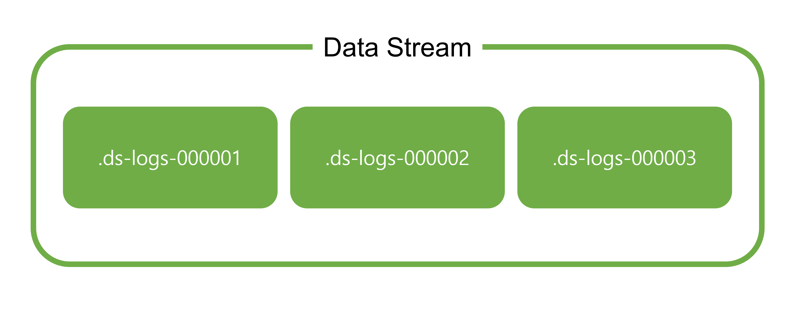
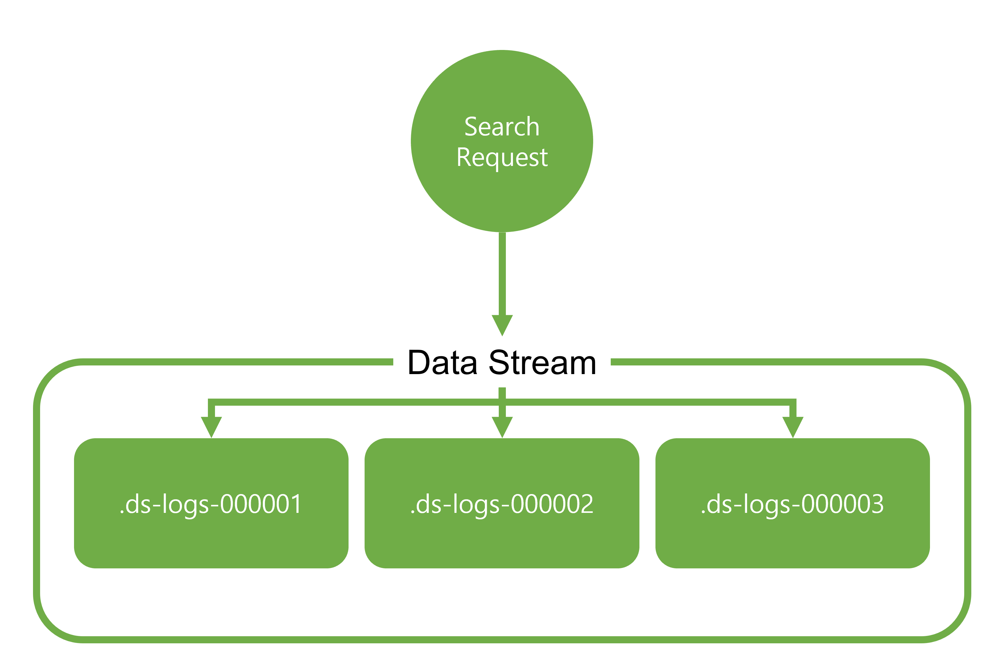
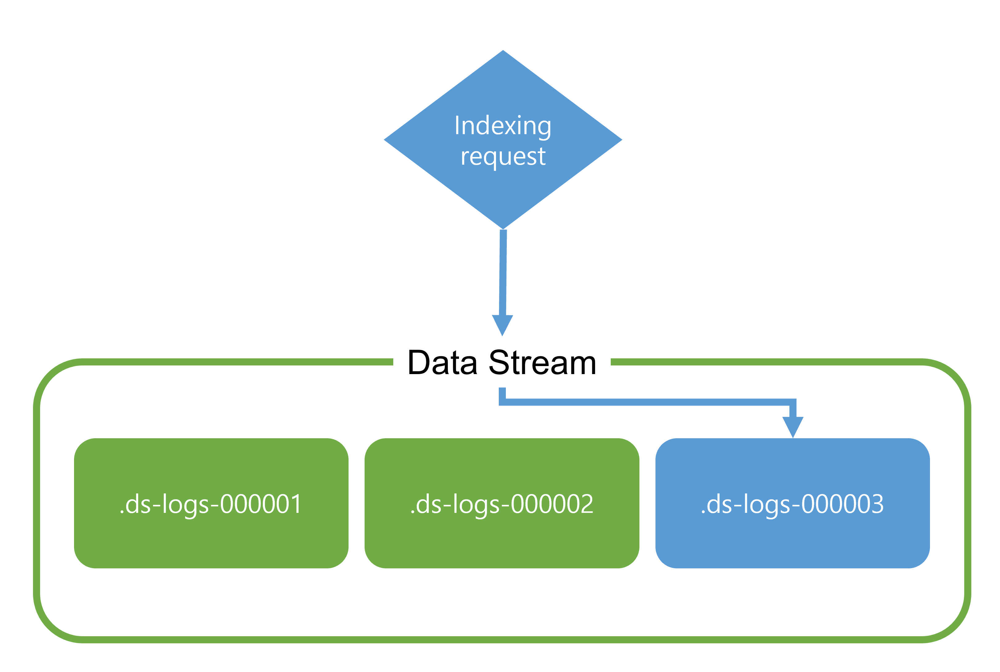

# 2022. 12. 05.

## Elasticsearch(7.10)

### 데이터 스트림

데이터 스트림으로 요청에 대해 명명된 단일 리소스를 제공하면서 여러 인덱스에 걸쳐 추가만 가능한(append-only) 시계열(time series) 데이터를 저장할 수 있다. 데이터 스트림은 로그, 이벤트, 메트릭 등 지속적으로 생성되는 데이터에 잘 맞는다.

인덱싱과 검색 요청을 데이터 스트림으로 직접 보낼 수 있다. 스트림은 자동으로 스트림의 데이터를 저장하고 있는 기반 인덱스(backing index)로 요청을 라우트한다. [인덱스 생명주기 관리(ILM)][ilm]를 사용해 기반 인덱스의 관리를 자동화할 수 있다. 예를 들어, ILM을 사용해 자동으로 오래된 기반 인덱스를 덜 비싼 하드웨어로 옮기고 불필요한 인덱스를 제거할 수 있다. ILM은 데이터가 증가함에 따라 생기는 비용과 오버헤드를 제거하는 데 도움을 줄 수 있다.

#### 기반 인덱스(Backing indices)

데이터 스트림은 하나 이상의 [숨겨진][index-hidden] 자동 생성되는 기반 인덱스로 구성된다.



각 데이터 스트림은 일치하는 [인덱스 템플릿][index-template]이 필요하다. 템플릿은 스트림의 기반 인덱스를 구성하는 데 사용할 매핑과 설정을 갖는다.

데이터 스트림에 인덱스되는 모든 도큐먼트는 [`date`][date-type]이나 [`date_nanos`][date-nanos-type] 필드 타입으로 매핑된 `@timestamp` 필드를 가져야 한다. 인덱스 템플릿이 `@timestamp` 필드에 대한 매핑을 명시하지 않으면 Elasticsearch가 기본적으로 `@timestamp`를 기본 옵션과 함께 `date` 필드로 매핑한다.

같은 인덱스 템플릿을 사용해 여러 데이터 스트림을 만들 수 있다. 데이터 스트림에서 사용중인 인덱스 템플릿은 삭제할 수 없다.

#### 읽기 요청

데이터 스트림에 읽기 요청을 보내면 스트림은 요청을 자신의 모든 기반 인덱스로 라우팅한다.



#### 쓰기 인덱스

가장 최근에 생성된 기반 인덱스가 데이터 스트림의 쓰기 인덱스가 된다. 스트림은 이 인덱스에만 새 도큐먼트를 추가한다.



인덱스에 직접 요청을 보내더라도 새 도큐먼트를 다른 기반 인덱스에 추가할 수 없다.

또한 쓰기 인덱스에는 인덱싱을 방해하는 연산을 다음과 같은 연산을 수행할 수 없다:

- [Clone](https://www.elastic.co/guide/en/elasticsearch/reference/7.10/indices-clone-index.html)
- [Close](https://www.elastic.co/guide/en/elasticsearch/reference/7.10/indices-close.html)
- [Delete](https://www.elastic.co/guide/en/elasticsearch/reference/7.10/indices-delete-index.html)
- [Freeze](https://www.elastic.co/guide/en/elasticsearch/reference/7.10/freeze-index-api.html)
- [Shrink](https://www.elastic.co/guide/en/elasticsearch/reference/7.10/indices-shrink-index.html)
- [Split](https://www.elastic.co/guide/en/elasticsearch/reference/7.10/indices-split-index.html)

#### 롤오버(Rollover)

데이터 스트림을 만들면 Elasticsearch가 자동으로 스트림에 대한 기반 인덱스를 생성한다. 이 인덱스는 스트림의 첫 쓰기 인덱스로써도 동작한다. [롤오버][rollover]는 스트림의 새 쓰기 인덱스가 되는 새 기반 인덱스를 생성한다.

쓰기 인덱스가 지정된 수명이나 크기에 도달하면 [ILM][ilm]을 아숑해 데이터 스트림을 자동으로 롤 오버하는 것을 권장한다. 필요한 경우 데이터 스트림을 [수동으로 롤 오버][rollover-manually]할 수 있다.

#### 세대(Generation)

각 데이터 스트림은 자신의 세대(generation)을 추적한다. 세대는 `000001`부터 시작하는 빈 자리를 0으로 채우는 여섯 자리 정수로, 스트림의 롤오버를 누적하는 카운트로 동작한다.

기반 인덱스가 생성되면 인덱스는 다음 컨벤션으로 명명된다:

```
.ds-<data-stream>-<generation>
```

더 높은 세대의 기반 인덱스가 더 최근의 데이터를 갖는다. 예를 들어, `we-server-logs` 데이터 스트림은 `34`의 세대를 갖는다면 스트림의 가장 최근의 기반 인덱스는 `.ds-web-server-logs-000034`로 명명된다.

[shrink][shrink-operation]나 [restore][restore-operation]와 같은 일부 연산은 기반 인덱스의 이름을 바꿀 수 있다. 이 이름 변경은 데이터 스트림에서 기반 인덱스를 제거하지 않는다.

#### 추가 전용(Append-only)

데이터 스트림은 기존 데이터가 드물게 갱신되는 유스 케이스에 대해 설계됐다. 스트림 데이터에 직접 기존 도큐먼트에 대한 갱신이나 삭제 요청을 보낼 수 없다. 대신 [쿼리에 의한 갱신][data-stream-update-by-query]와 [쿼리에 의한 삭제][data-stream-delete-by-query] API를 사용하라.

필요한 경우 도큐먼트의 기반 인덱스에 직접 [도큐먼트 갱신이나 삭제][update-or-delete-docs-in-data-stream] 요청을 보낼 수 있다.

> 기존 도큐먼트에 대한 갱신이나 삭제가 빈번한 경우 데이터 스트림 대신 [인덱스 별칭][index-alias]과 [인덱스 템플릿][index-template]을 사용하라. 여전히 [ILM][ilm]을 사용해 별칭에 대한 인덱스를 관리할 수 있다.

[ilm]: https://www.elastic.co/guide/en/elasticsearch/reference/7.10/index-lifecycle-management.html
[index-hidden]: https://www.elastic.co/guide/en/elasticsearch/reference/7.10/index-modules.html#index-hidden
[index-template]: https://www.elastic.co/guide/en/elasticsearch/reference/7.10/index-templates.html
[date-type]: https://www.elastic.co/guide/en/elasticsearch/reference/7.10/date.html
[date-nanos-type]: https://www.elastic.co/guide/en/elasticsearch/reference/7.10/date_nanos.html
[rollover]: https://www.elastic.co/guide/en/elasticsearch/reference/7.10/indices-rollover-index.html
[rollover-manually]: https://www.elastic.co/guide/en/elasticsearch/reference/7.10/use-a-data-stream.html#manually-roll-over-a-data-stream
[shrink-operation]: https://www.elastic.co/guide/en/elasticsearch/reference/7.10/indices-shrink-index.html
[restore-operation]: https://www.elastic.co/guide/en/elasticsearch/reference/7.10/snapshots-restore-snapshot.html
[data-stream-update-by-query]: https://www.elastic.co/guide/en/elasticsearch/reference/7.10/use-a-data-stream.html#update-docs-in-a-data-stream-by-query
[data-stream-delete-by-query]: https://www.elastic.co/guide/en/elasticsearch/reference/7.10/use-a-data-stream.html#delete-docs-in-a-data-stream-by-query
[update-or-delete-docs-in-data-stream]: https://www.elastic.co/guide/en/elasticsearch/reference/7.10/use-a-data-stream.html#update-delete-docs-in-a-backing-index
[index-alias]: https://www.elastic.co/guide/en/elasticsearch/reference/7.10/indices-add-alias.html