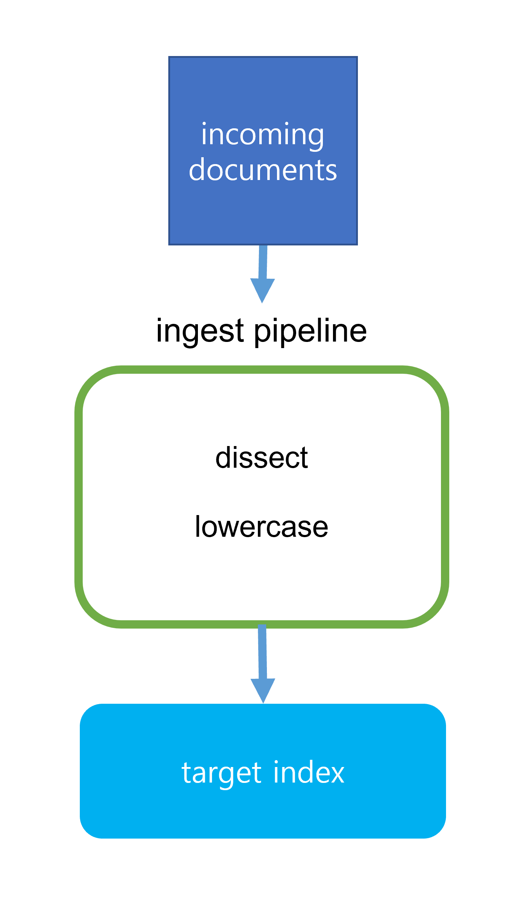
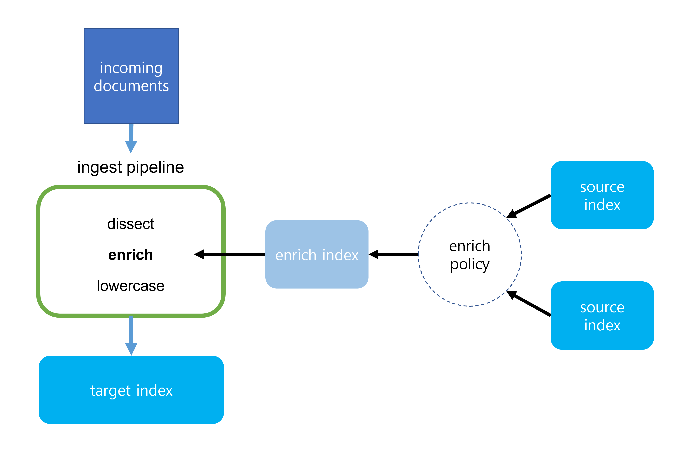

# 2022. 12. 15.

## Elasticsearch(7.10)

### 처리(ingest) 노드 - 데이터 보강(enrich)

[보강 프로세서](https://www.elastic.co/guide/en/elasticsearch/reference/7.10/enrich-processor.html)(enrich processor)를 사용해 처리 과정에서 인입되는 도큐먼트에 기존 인덱스로부터 데이터를 추가할 수 있다.

예를 들어, 보강 프로세서로 다음과 같은 일을 할 수 있다:

* 알려진 IP 주소를 기반으로 웹 서비스나 벤더 식별
* 제품 ID를 기반으로 소매(retail) 주문에 제품 정보 추가
* 이메일 주소를 기반으로 연락처 정보 보충
* 사용자 좌표를 기반으로 우편 번호 추가

#### 보강 프로세서 동작 방식

[처리 파이프라인][ingest]은 도큐먼트가 실제로 인덱스되기 전에 도큐먼트를 변경한다. 처리 파이프라인을 [프로세서][ingest-processor]라는 작업자들로 구성된 조립 라인으로 생각할 수도 있다. 각 프로세서는 인입되는 도큐먼트가 다음으로 넘어가기 전에 필드 값을 소문자로 바꾸는 것과 같이 특정한 변경을 만든다. 파이프라인의 모든 프로세서가 끝나면 완료된 도큐먼트가 대상 인덱스에 추가된다.

대부분의 프로세서는 자립적(self-contained)이며 인입되는 도큐먼트에 *존재하는* 데이터를 바꾸기만 한다. 하지만 보강 프로세서는 인입되는 도큐먼트에 *새* 데이터를 추가하며 몇가지 특수한 구성 요소를 필요로 한다.

**보강 정책**

구성 옵션의 집합으로, 올바른 보강 데이터를 올바른 인입 도큐먼트에 추가하는 데 사용한다.

보강 정책은 다음을 갖는다:

* 보강 데이터를 도큐먼트로 저장하는 하나 이상의 *소스 인덱스* 목록
* 프로세서가 인입 도큐먼트를 보강 데이터에 일치시키는 방법을 결정하는 *정책 유형*
* 인입 도큐먼트를 일치시키는 데 사용하는 소스 인덱스의 *일치 필드*
* 인입 도큐먼트에 추가할 소스 인덱스의 보강 데이터를 가진 *보강 필드*

보강 프로세서로 사용될 수 있기 전에, 보강 정책이 [실행][execute-enrich-policy-api]돼야 한다. 실행되면 보강 정책은 정책의 소스 인덱스로부터 보강 데이터를 사용해 *보강 인덱스*라 불리는 간단한 시스템 인덱스를 생성한다. 프로세서는 이 인덱스를 사용해 인입 도큐먼트를 일치시키고 보강한다.

전체 보강 정책 유형과 구성 옵션의 목록은 [보강 정책 정의][enrich-policy-definition]를 참고하라.

**소스 인덱스**

인입 도큐먼트에 추가하고자 하는 보강 데이터를 저장하는 인덱스. 평범한 Elasticsearch 인덱스처럼 생성하고 관리할 수 있다. 하나의 보강 정책에 여러 소스 인덱스를 사용할 수 있다. 하나의 소스 인덱스를 여러 보강 정책에 사용할 수도 있다.

**보강 인덱스**

특정 보강 정책에 엮인 특수한 시스템 인덱스.

인입 도큐먼트를 소스 인덱스의 도큐먼트에 직접 일치시키는 것은 느릴 수도 있고 리소스 집중적이다. 이 속도를 높이기 위해 보강 프로세서는 보강 인덱스를 사용한다.

보강 인덱스는 소스 인덱스의 보강 데이터를 갖지만 몇 가지 특수한 프로퍼티를 갖는다:

* 이들은 시스템 인덱스이다. 즉, Elasticsearch에 의해 내부적으로 관리되며 보강 프로세서와 함께 사용되는 것만을 목적으로 한다.
* 항상 `.enrich-*`로 시작한다.
* 읽기 전용이다. 즉, 직접적으로 변경할 수는 없다.
* 빠른 조회를 위해 [강제 병합][force-merge]된다.

[ingest]: https://www.elastic.co/guide/en/elasticsearch/reference/7.10/ingest.html
[ingest-processor]: https://www.elastic.co/guide/en/elasticsearch/reference/7.10/ingest-processors.html
[execute-enrich-policy-api]: https://www.elastic.co/guide/en/elasticsearch/reference/7.10/execute-enrich-policy-api.html
[enrich-policy-definition]: https://www.elastic.co/guide/en/elasticsearch/reference/7.10/enrich-policy-definition.html
[force-merge]: https://www.elastic.co/guide/en/elasticsearch/reference/7.10/indices-forcemerge.html