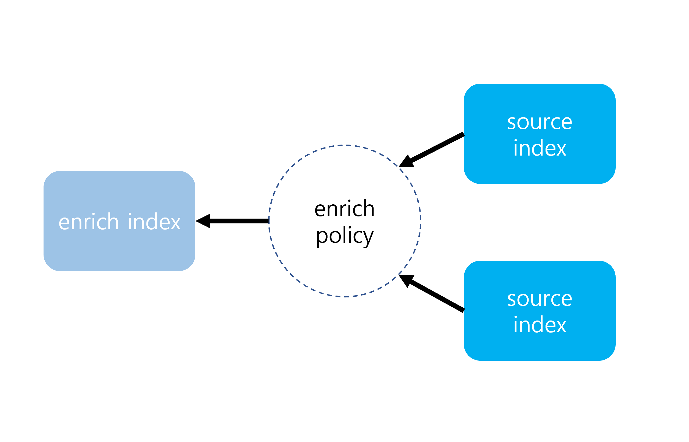
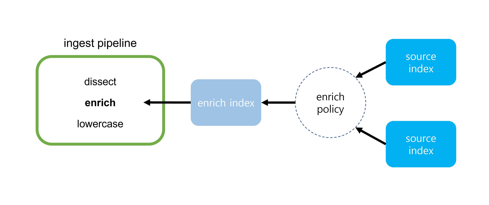
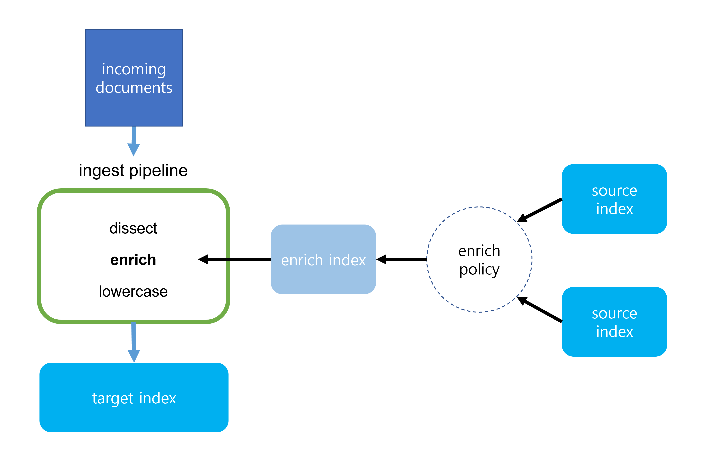

# 2022. 12. 16.

## Elasticsearch(7.10)

### 처리(ingest) 노드 - 데이터 보강(enrich)

#### 보강 프로세서 설정

보강 프로세서를 설정하려면 다음 단계를 따른다:

1. [사전 준비사항](https://www.elastic.co/guide/en/elasticsearch/reference/7.10/enrich-setup.html#enrich-prereqs) 확인.
2. [보강 데이터 추가](https://www.elastic.co/guide/en/elasticsearch/reference/7.10/enrich-setup.html#create-enrich-source-index).
3. [보강 정책 생성](https://www.elastic.co/guide/en/elasticsearch/reference/7.10/enrich-setup.html#create-enrich-policy).
4. [보강 정책 실행](https://www.elastic.co/guide/en/elasticsearch/reference/7.10/enrich-setup.html#execute-enrich-policy).
5. [처리 파이프라인에 보강 프로세서 추가](https://www.elastic.co/guide/en/elasticsearch/reference/7.10/enrich-setup.html#add-enrich-processor).
6. [도큐먼트 처리 및 보강](https://www.elastic.co/guide/en/elasticsearch/reference/7.10/enrich-setup.html#ingest-enrich-docs).

보강 프로세서를 설정하고 나면 [보강 데이터를 갱신][update-enrich-index]하고 [보강 정책을 업데이트][update-enrich-policy]할 수 있다.

> 보강 프로세서는 몇가지 연산을 수행하며 [처리 파이프라인][ingest-pipeline] 속도에 영향을 미칠 수 있다.
>
> 프로덕션에 배포하기 전에 보강 프로세서를 테스트하고 벤치마킹할 것을 강력히 추천한다.
>
> 실시간 데이터를 추가하는 데에 보강 프로세서를 사용하는 것은 권장하지 않는다. 보강 프로세서는 참조 데이터가 자주 변경되지 않을 때 가장 잘 동작한다.

###### 사전 준비사항

Elasticsearch 보안 기능을 사용한다면 다음이 필요하다:

* 사용되는 모든 인덱스에 대한 `read` 인덱스 권한(privilege)
* `enrich_user` [내장 역할][builtin-role]

##### 보강 데이터 추가

먼저, 하나 이상의 소스 인덱스에 도큐먼트를 추가한다. 이 도큐먼트는 인입되는 도큐먼트에 추가할 데이터를 포함하고 있어야 한다.

소스 인덱스는 보통의 Elasticsearch 인덱스처럼 [도큐먼트][document-api]와 [인덱스][index-api] API를 사용해 관리할 수 있다.

[Filebeat][filebeat]과 같은 [Beats][beats]를 추가해 소스 인덱스에 도큐먼트를 보내 자동으로 인덱스할 수도 있다. [Beats 시작하기][getting-started-with-beats] 참고.

##### 보강 정책 생성

소스 인덱스에 보강 데이터를 추가하고 나면 [보강 정책을 정의][enrich-policy-definition]할 수 있다. 보강 정책을 정의할 때는 적어도 다음을 포함해야 한다:

* 보강 데이터를 도큐먼트로 저장하는 하나 이상의 *소스 인덱스* 목록
* 프로세서가 인입되는 도큐먼트에 보강 데이터를 일치시키는 방법을 결정하는 *정책 유형*
* 인입 도큐먼트를 일치시키는 데 사용할 소스 인덱스의 *일치 필드*
* 인입 도큐먼트에 추가하고자 하는 소스 인덱스의 보강 데이터를 가진 *보강 필드*

[보강 정책 PUT API][put-enrich-policy-api]로 이 정의를 사용해 보강 정책을 생성할 수 있다.

> 보강 정책은 한 번 생성되면 바꿀 수 없다. [보강 정책 갱신][update-enrich-policy] 참조.

##### 보강 정책 실행

보강 정책이 생성되면 [보강 정책 실행 API][execute-enrich-policy-api]로 이를 실행해 [보강 인덱스][enrich-index]를 생성할 수 있다.

*보강 인덱스*는 정책의 소스 인덱스의 도큐먼트를 갖는다. 보강 인덱스는 항상 `.enrich-*`로 시작하며 읽기 전용이고 [강제 병합][force-merge-api]된다.

> 보강 인덱스는 [보강 프로세서][enrich-processor]에서만 사용돼야 한다. 보강 인덱스를 다른 목적으로 사용하는 것은 피하라.

##### 처리 파이프라인에 보강 프로세서 추가

소스 인덱스, 보강 정책, 그리고 관련된 보강 인덱스가 생기면 보강 정책에 대한 보강 프로세서를 가진 처리 파이프라인을 설정할 수 있다.

[파이프라인 PUT API][put-pipeline-api]를 사용해 [보강 프로세서][enrich-processor]를 정의하고 처리 파이프라인에 추가한다.

보강 프로세서를 정의할 때는 적어도 다음을 포함해야 한다:

* 사용할 보강 정책.
* 인입되는 도큐먼트를 보강 인덱스의 도큐먼트에 일치시키는데 사용할 필드.
* 인입되는 도큐먼트에 추가할 대상 필드. 이 대상 필드는 보강 정책에 명시된 일치하는 보강 필드를 갖는다.

`max_matches` 옵션을 사용해 인입되는 도큐먼트가 일치할 수 있는 보강 도큐먼트의 수를 설정할 수 있다. 기본값인 `1`로 설정되면 데이터는 인입 도큐먼트의 대상 필드에 JSON 객체로 추가된다. 그 외에는 데이터가 배열로 추가된다.

구성 옵션의 전체 목록은 [보강 프로세서][enrich-processor]를 참고하라.

처리 파이프라인에 다른 [프로세서][ingest-processor]도 추가할 수 있다.

##### 도큐먼트 처리 및 보강

이제 처리 파이프라인을 사용해 도큐먼트를 보강하고 인덱스할 수 있다.

파이프라인을 프로덕션에서 구현하기 전에 먼저 몇 개의 테스트 도큐먼트를 인덱싱하고 [GET API][get-docs-api]를 사용해  보강 데이터가 올바르게 추가되는지 확인해볼 것을 권한다.

##### 보강 인덱스 갱신

보강 인덱스는 한번 생성되면 갱신하거나 도큐먼트를 인덱스할 수 없다. 그 대신, 소스 인덱스를 갱신하고 보강 정책을 다시 [실행][execute-enrich-policy-api]하라. 이렇게 하면 갱신된 소스 인덱스로부터 새 보강 인덱스를 생성하고 이전 보강 인덱스를 제거한다.

원한다면 처리 파이프라인을 사용해 이미 처리된 도큐먼트를 [재인덱스][reindex]하거나 [갱신][update-by-query-api]할 수 있다.

##### 보강 정책 갱신

보강 정책은 한번 생성되면 갱신하거나 변경할 수 없다. 대신, 다음과 같이 할 수 있다:

* 새 보강 정책 생성 및 [실행][execute-enrich-policy-api].
* 사용중인 보강 프로세서에서 이전 보강 정책을 새 보강 정책으로 대체.
* [보강 정책 삭제][delete-enrich-policy-api] API를 사용해 이전 보강 정책 삭제.

[update-enrich-index]: https://www.elastic.co/guide/en/elasticsearch/reference/7.10/enrich-setup.html#update-enrich-data
[update-enrich-policy]: https://www.elastic.co/guide/en/elasticsearch/reference/7.10/enrich-setup.html#update-enrich-policies
[ingest-pipeline]: https://www.elastic.co/guide/en/elasticsearch/reference/7.10/pipeline.html
[builtin-role]: https://www.elastic.co/guide/en/elasticsearch/reference/7.10/built-in-roles.html
[document-api]: https://www.elastic.co/guide/en/elasticsearch/reference/7.10/docs.html
[index-api]: https://www.elastic.co/guide/en/elasticsearch/reference/7.10/indices.html
[beats]: https://www.elastic.co/guide/en/beats/libbeat/7.10/getting-started.html
[filebeat]: https://www.elastic.co/guide/en/beats/filebeat/7.10/filebeat-installation-configuration.html
[getting-started-with-beats]: https://www.elastic.co/guide/en/beats/libbeat/7.10/getting-started.html
[enrich-policy-definition]: https://www.elastic.co/guide/en/elasticsearch/reference/7.10/enrich-policy-definition.html
[put-enrich-policy-api]: https://www.elastic.co/guide/en/elasticsearch/reference/7.10/put-enrich-policy-api.html
[enrich-index]: https://www.elastic.co/guide/en/elasticsearch/reference/7.10/ingest-enriching-data.html#enrich-index
[execute-enrich-policy-api]: https://www.elastic.co/guide/en/elasticsearch/reference/7.10/execute-enrich-policy-api.html
[force-merge-api]: https://www.elastic.co/guide/en/elasticsearch/reference/7.10/indices-forcemerge.html
[enrich-processor]: https://www.elastic.co/guide/en/elasticsearch/reference/7.10/enrich-processor.html
[put-pipeline-api]: https://www.elastic.co/guide/en/elasticsearch/reference/7.10/put-pipeline-api.html
[ingest-processor]: https://www.elastic.co/guide/en/elasticsearch/reference/7.10/ingest-processors.html
[get-docs-api]: https://www.elastic.co/guide/en/elasticsearch/reference/7.10/docs-get.html
[reindex]: 
[update-by-query-api]: https://www.elastic.co/guide/en/elasticsearch/reference/7.10/docs-update-by-query.html
[delete-enrich-policy-api]: https://www.elastic.co/guide/en/elasticsearch/reference/7.10/delete-enrich-policy-api.html