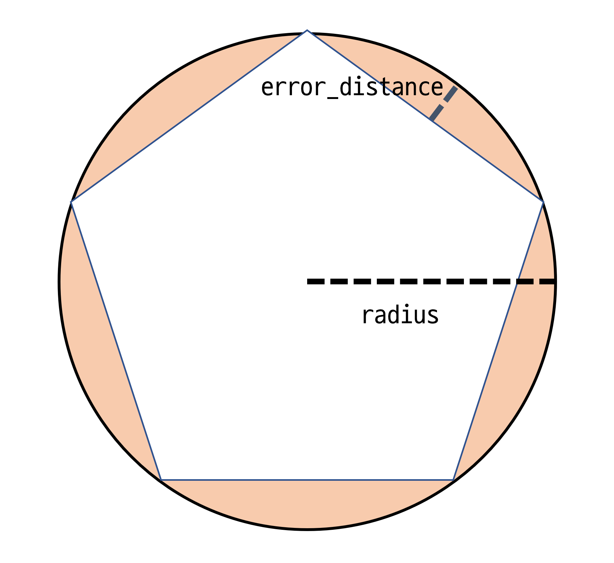

# 2022. 12. 23.

## Elasticsearch(7.10)

### 처리(ingest) 노드 - 프로세서

#### Circle 프로세서

도형의 원(circle) 정의를 가장 근사(approximate)한 정규 폴리곤으로 변환한다.

**Table 5. Circle 프로세서 옵션**

| 이름             | 필수 | 기본값  | 설명                                                         |
| ---------------- | ---- | ------- | ------------------------------------------------------------ |
| `field`          | yes  | -       | 공백을 제거할 문자열 값 필드                                 |
| `target_field`   | no   | `field` | 폴리곤 도형을 할당할 필드, 기본값은 `field`가 그대로 갱신된다. |
| `ignore_missing` | no   | `false` | `true`이고 `field`가 존재하지 않으면 프로세서는 도큐먼트를 변형하지 않고 조용히 종료한다. |
| `error_distance` | yes  | -       | 중심에서 측면까지의 거리와 원의 반지름과의 차이(`geo_shape`인 경우 미터 단위로 측정, `shape`인 경우 단위 없음) |
| `shape_type`     | yes  | -       | 원을 처리할 때 사용할 필드 매핑 타입: `geo_shape` 혹은 `shape` |
| `if`             | no   | -       | 프로세서를 조건부로 실행한다.                                |
| `on_failure`     | no   | -       | 이 프로세서의 실패를 처리한다. [*파이프라인에서 실패 처리*](https://www.elastic.co/guide/en/elasticsearch/reference/7.10/handling-failure-in-pipelines.html) 참고. |
| `ignore_failure` | no   | `false` | 이 프로세서의 실패를 무시한다. [*파이프라인에서 실패 처리*](https://www.elastic.co/guide/en/elasticsearch/reference/7.10/handling-failure-in-pipelines.html) 참고. |
| `tag`            | no   | -       | 이 프로세서의 식별자. 디버깅과 메트릭에 유용하다.            |



```http
PUT circles
{
  "mappings": {
    "properties": {
      "circle": {
        "type": "geo_shape"
      }
    }
  }
}

PUT _ingest/pipeline/polygonize_circles
{
  "description": "translate circle to polygon",
  "processors": [
    {
      "circle": {
        "field": "circle",
        "error_distance": 28.0,
        "shape_type": "geo_shape"
      }
    }
  ]
}
```

위 파이프라인을 사용하면 `circles` 인덱스로 도큐먼트를 인덱스할 수 있다. 원은 WKT 원이나 GeoJSON 원 중 하나로 표현할 수 있다. 결과 폴리곤은 입력 원과 같은 형식을 사용해 표현되고 인덱스된다. WKT WKT 폴리곤으로, GeoJSON 원은 GeoJSON 폴리곤으로 번역된다.

##### 예제: Well Known Text로 정의된 원

이 예제에서는 WKT 형식으로 정의된 원이 인덱스된다

```http
PUT circles/_doc/1?pipeline=polygonize_circles
{
  "circle": "CIRCLE (30 10 40)"
}

GET circles/_doc/1
```

위 인덱스 요청의 응답은 다음과 같다:

```json
{
  "found": true,
  "_index": "circles",
  "_type": "_doc",
  "_id": "1",
  "_version": 1,
  "_seq_no": 22,
  "_primary_term": 1,
  "_source": {
    "circle": "POLYGON ((30.000365257263184 10.0, 30.000111397193788 10.00034284530941, 29.999706043744222 10.000213571721195, 29.999706043744222 9.999786428278805, 30.000111397193788 9.99965715469059, 30.000365257263184 10.0))"
  }
}
```

##### 예제: GeoJSON으로 정의된 원

이 예제에서는 GeoJSON 형식으로 정의된 원이 인덱스된다

```http
PUT circles/_doc/2?pipeline=polygonize_circles
{
  "circle": {
    "type": "circle",
    "radius": "40m",
    "coordinates": [30, 10]
  }
}

GET circles/_doc/2
```

위 인덱스 요청의 응답은 다음과 같다:

```json
{
  "found": true,
  "_index": "circles",
  "_type": "_doc",
  "_id": "2",
  "_version": 1,
  "_seq_no": 22,
  "_primary_term": 1,
  "_source": {
    "circle": {
      "coordinates": [
        [
          [30.000365257263184, 10.0],
          [30.000111397193788, 10.00034284530941],
          [29.999706043744222, 10.000213571721195],
          [29.999706043744222, 9.999786428278805],
          [30.000111397193788, 9.99965715469059],
          [30.000365257263184, 10.0]
        ]
      ],
      "type": "Polygon"
    }
  }
}
```

##### 정확도에 관한 참고

원을 나타내는 폴리곤의 정확도는 `error_distance`에 따라 정의된다. 이 차이가 작을수록 폴리곤은 완벽한 원에 더 가까워진다.

아래는 서로 다른 입력에 따라 원의 반지름이 결과 폴리곤의 변의 수에 미치는 영향을 나타낸다.

면의 최소 개수는 `4`이고 최대 개수는 `1000`이다.

**Table 6. Circle 프로세서 정확도**

| error_distance | 미터 반지름 | 폴리곤의 변의 수 |
| -------------- | ----------- | ---------------- |
| 1.00           | 1.0         | 4                |
| 1.00           | 10.0        | 14               |
| 1.00           | 100.0       | 45               |
| 1.00           | 1000.0      | 141              |
| 1.00           | 10000.0     | 445              |
| 1.00           | 100000.0    | 1000             |