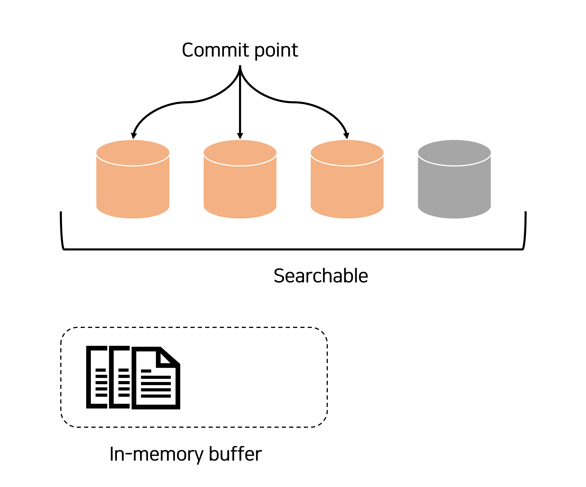

# 2023. 02. 15.

## Elasticsearch(7.10)

### 데이터 검색 - 근실시간 검색

[도큐먼트와 인덱스][documents-and-indices] 개요는 도큐먼트가 Elasticsearch에 저장되면 *근실시간* -- 1초 이내--에 인덱스되고 완전히 검색 가능함을 나타낸다. 근실시간 검색이란 무엇인가?

Elasticsearch가 기반으로 하고 있는 Java 라이브러리인 Lucene은 세그먼트별 검색이란 개념을 도입했다. *세그먼트*는 역인덱스와 비슷하지만 Lucene에서 *인덱스*라는 단어는 "세그먼트의 모음에 커밋 지점을 더한 것"을 의미한다. 커밋된 뒤에는 새 세그먼트가 커밋 지점에 추가되고 버퍼가 비워진다.

Elasticsearch와 디스크 사이에 있는 것이 파일시스템 캐시다. 인-메모리 인덱싱 버퍼(그림 1)의 도큐먼트는 새 세그먼트(그림 2)에 쓰여진다. 새 세그먼트는 (비용이 저렴한) 파일 시스템 캐시에 먼저 쓰여지고 나중에 (비용이 비싼)디스크로 플러시된다. 하지만 파일이 캐시에 있으면 다른 파일처럼 열고 읽을 수 있다.

***그림 1. 인-메모리 버퍼에 새 도큐먼트가 있는 Lucene 인덱스***

Lucene은 가지고 있는 도큐먼트가 완전히 커밋되지 않고도 검색에 나타나게 해 새 세그먼트를 쓰거나 열 수 있도록 한다. 이는 디스크에 커밋하는 과정보다 훨씬 가벼우며 성능을 저하시키지 않고도 자주 수행할 수 있다.

***그림 2. 세그먼트에 쓰여지는 버퍼 내용은 검색 가능하지만 아직 커밋되지 않았다***

Elasticsearch에서 새 세그먼트를 쓰고 여는 과정은 *리프레시*라 불린다. 리프레시는 인덱스에 수행되는 모든 연산이 검색에 사요 가능한 마지막 리프레시 이후의 인덱스에 대해 수행되도록 한다. 다음 방법으로 리프레시를 통제할 수 있다:

* 리프레시 주기 대기
* [`?refresh`][query-param-refresh] 옵션 설정
* [리프레시 API][refresh-api]를 사용해 명시적으로 리프레시 완료(`POST _refresh`)

[documents-and-indices]: https://www.elastic.co/guide/en/elasticsearch/reference/7.10/documents-indices.html
[query-param-refresh]: https://www.elastic.co/guide/en/elasticsearch/reference/7.10/docs-refresh.html
[refresh-api]: https://www.elastic.co/guide/en/elasticsearch/reference/7.10/indices-refresh.html