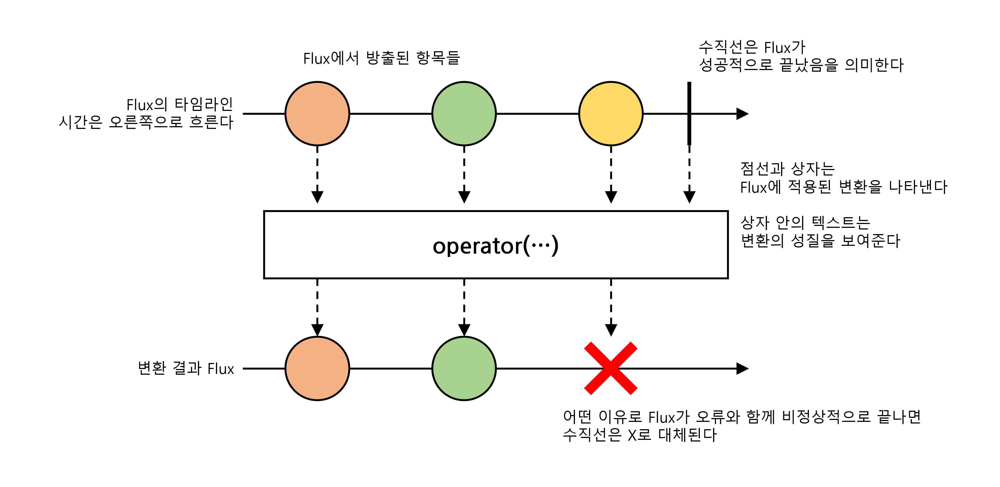

# 2025. 02. 01.

## Reactor 3 Reference Guide

### Reactor Core 기능

#### Flux, 0-N 개 항목의 비동기 시퀀스

다음 이미지는 `Flux`가 어떻게 항목들을 변환하는지 보여준다:

`Flux<T>`는 0에서 N개의 방출된 항목의 비동기 시퀀스를 나타낸다. 선택사항으로 완료나 오류 신호 중 하나로 끝난다. 리액티브 스트림즈 명세에서 이 세 유형의 신호는 다운스트림 구독자의 `onNext`, `onComplete`, `onError` 메서드에 대한 호출로 번역한다.

넓은 영역의 신호와 함께, `Flux`는 일반 목적 리액티브 타입이다. 모든 이벤트, 심지거 끝내는 것조차도 선택사항이라는 점을 알아두라. `onNext` 이벤트 없는 `onComplete` 이벤트는 *비어 있는* 유한 시퀀스를 나타내지만, `onComplete`을 제거하면 비어 있는 *무한* 시퀀스가 된다(취소와 관련된 테스트를 제외하고 딱히 유용하지는 않다). 비슷하게, 무한 시퀀스는 비어있을 필요 없다. 예를 들어, `Flux.interval(Duration)`은 시계(clock)로부터 일정하게 무한히 틱(tick) 신호를 보내는 `Flux<Long>`을 만든다.

