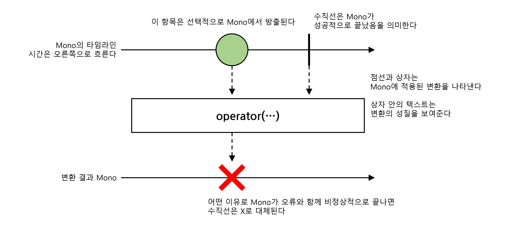

# 2025. 02. 02.

## Reactor 3 Reference Guide

### Reactor Core 기능

#### Mono, 0-1 개 결과의 비동기 시퀀스

다음 이미지는 `Mono`가 항목을 어떻게 변환하는지 보여준다:

`Mono<T>`는 최대 한 개의 항목을 `onNext` 신호를 *통해* 방출한 다음 `onComplete` 신호(값이 있든 없든 성공한 `Mono`)로 종료하거나 하나의 `onError` 신호만 방출(실패한 `Mono`)하는 데 특화된 `Publisher<T>`다.

대부분의 `Mono` 구현체는 `Subscriber`에게 `onNext` 호출 뒤 즉시 `onComplete`을 호출할 것이다. `Mono.never()`는 예외적으로 어떤 신호도 방출하지 않아 테스트 외에는 거의 쓸모가 없다. 반면 `onNext`와 `onError`의 조합은 명시적으로 금지된다.

`Mono`는 `Flux`에 사용 가능한 연산자의 일부만 제공하며, 일부 연산자(특히 `Mono`를 다른 `Publisher`와 결합하는)는 `Flux`로 전환한다. 예를 들어, `Mono#concatWith(Publisher)`는 `Flux`를 반환하지만 `Mono#then(Mono)`는 또다른 `Mono`를 반환한다.

`Mono`를 사용해 (`Runnable`과 비슷하게)완료 개념만 있고 값은 없는 비동기 처리를 나타낼 수 있다. 비어 있는 `Mono<Void>`를 사용하면 된다.

