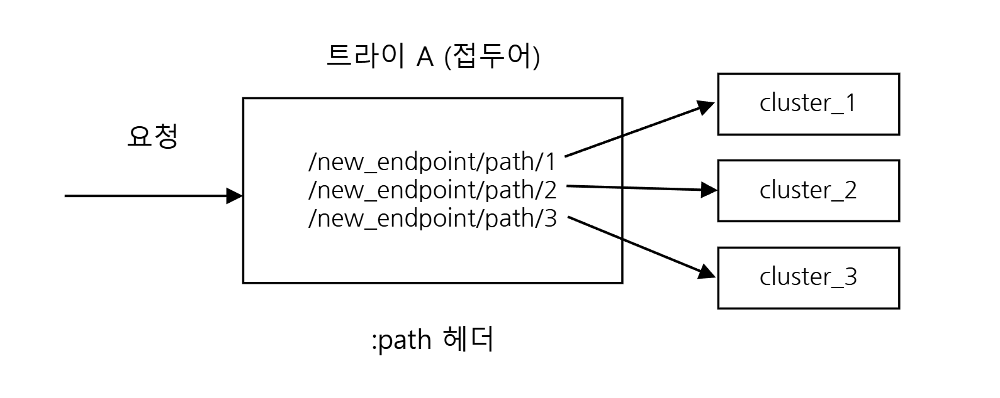
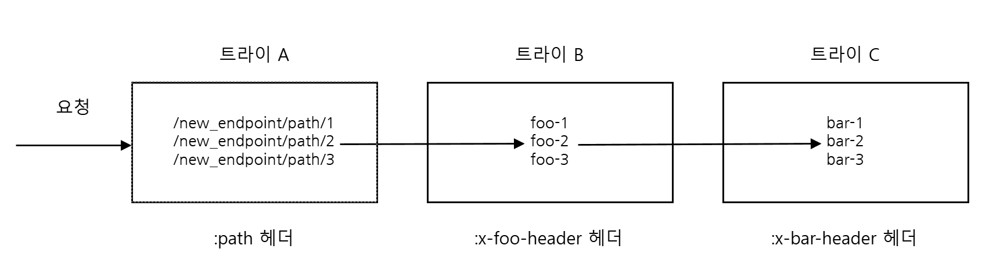
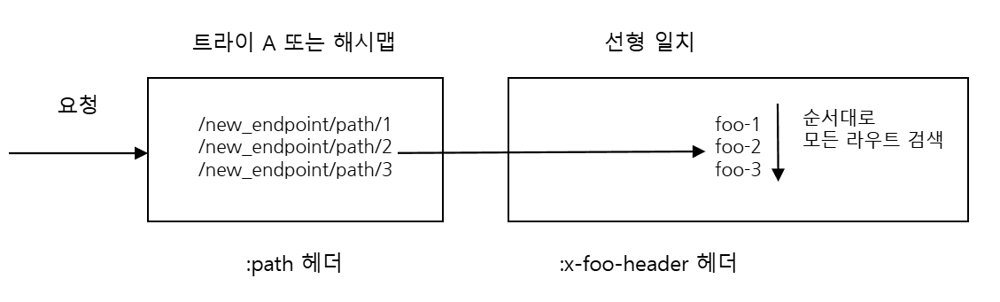

# 2025-12-24

## Envoy

### 아키텍처 개요

#### 고급

##### 제네릭 일치

###### 아선형(sublinear) 라우트 일치

Envoy에 대한 인입 요청이 정의된 [라우트][api-http-route-management-http-route-components-virtual-host]에 따라 클러스터에 일치돼야 한다. 전형적으로 검색 비용이 O(n)인 잘 이해된 선형 라우트 검색 일치가 채용돼 라우트 수가 O(1k+)로 증가하면 지연이 증가하는 확장성 문제가 있다.

이 확장성 문제를 극복하기 위해 제네릭 일치자 API([matcher_tree][api-extensions-common-matcher-match-tree])가 구분되는 두 일치 구현으로 라우트 일치에 강건하고 유연한 프레임워크를 제공할 수 있다.

- **트라이(trie)-기반 일치** ([prefix_match_map][api-extensions-common-matcher-tree-prefix-matcher-map]): 효율적인 최장 접두어 일치에 O(# of routes x avg length of routes)인 전통적인 선형 검색과 비교해 훨씬 더 적은 시간 복잡도 O(min{input key length, longest prefix match})의 접두어 트라이 구조를 채용한다. Envoy의 트라이 구현은 메모리 최적화를 위해 자식 노드를 저장하는 데 범위가 지정된(ranged) 벡터를 활용한다. 또한 트라이에서 문자의 최장 접두어 일치 조회는 와일드카드를 지원하지 않고 문자는 그대로(literally) 일치된다.
- **해시맵-기반 일치** ([exact_match_map][api-extensions-common-matcher-tree-exact-matcher-map]): 정확한 문자열 일치에 상수 시간 On(1)인 해시맵 구조를 사용한다.

이 구현들은 [제네릭 일치 API][arch-advanced-generic-matching-matching-api]를 사용해 재귀적으로 쓰일 수 있고 심지어 중첩 형태로 서로 조합도 가능하다. 또한 다양한 유스 케이스를 위해 라우트 일치 공간 구분에 아선형과 선형 라우트 일치를 가능하게 한다.

**예시 1**: `:path` 헤더의 모든 url 경로에 대한 단일 트라이 구조

다음과 같이 아선형 라우트 검색에 트라이나 해시맵을 사용해 요청을 각 클러스터로 라우트하고자 한다고 가정하자



`:path` 헤더가 url `/new_endpoint/path/2/abc`로 설정된 요청은 `cluster_2`로 라우트돼야 한다

이를 위해 아래 Envoy 구성은 위의 경로 문자열을 가진 단일 트라이 구조를 만들고 인입 요청 `:path` 헤더에 대한 `findLongestPrefix()` 일치를 한 번 호출한다.

> [!NOTE]
>
> 아래 구성에서 `prefix_match_map`을 `exact_match_map`으로 바꾸면 해시 기반 경로 일치를 사용하고 요청의 `:path` 헤더가 정의된 라우트와 정확히 일치하면 조회에 성공할 것이다.

```yaml
                matcher_tree:
                  input:
                    name: request-headers
                    typed_config:
                      "@type": type.googleapis.com/envoy.type.matcher.v3.HttpRequestHeaderMatchInput
                      header_name: :path
                  prefix_match_map:
                    map:
                      "/new_endpoint/path/1":
                        action:
                          name: route_foo
                          typed_config:
                            "@type": type.googleapis.com/envoy.config.route.v3.Route
                            match:
                              prefix: ""
                            route:
                              cluster: cluster_1
                      "/new_endpoint/path/2":
                        action:
                          name: route_foo
                          typed_config:
                            "@type": type.googleapis.com/envoy.config.route.v3.Route
                            match:
                              prefix: ""
                            route:
                              cluster: cluster_2
                      "/new_endpoint/path/3":
                        action:
                          name: route_bar
                          typed_config:
                            "@type": type.googleapis.com/envoy.config.route.v3.Route
                            match:
                              prefix: ""
                            route:
                              cluster: cluster_3
```

**예시 2**: 아래의 계층적인 트라이 구조를 위한 구성은 Envoy가 여러 헤더에 요청을 일치시킬 수 있는 중첩된 `prefix_match_map`을 사용해 세 개의 서로 다른 트라이 구조를 만드는 방법을 보여준다:

> [!NOTE]
>
> `exact_match_map`은 트라이 대신 해시맵을 만들게 된다.



`:path` 헤더가 `/new_endpoint/path/2/video`, `x-foo-header`가 `foo-2`, `x-bar-header`가 `bar-2`로 설정된 인입 요청에 대해, 세 개의 최장 접두어 일치 트라이 조회가 중첩 순서대로 트라이 A, B, C에 대해 발생한다.

```yaml
                matcher_tree:
                  input:
                    name: request-headers
                    typed_config:
                      "@type": type.googleapis.com/envoy.type.matcher.v3.HttpRequestHeaderMatchInput
                      header_name: :path
                  prefix_match_map:
                    map:
                      "/new_endpoint/path/1":
                        action:
                          name: route_foo
                          typed_config:
                            "@type": type.googleapis.com/envoy.config.route.v3.Route
                            match:
                              prefix: ""
                            route:
                              cluster: cluster_1
                      "/new_endpoint/path/2":
                        matcher:
                          matcher_tree:
                            input:
                              name: request-headers
                              typed_config:
                                "@type": type.googleapis.com/envoy.type.matcher.v3.HttpRequestHeaderMatchInput
                                header_name: x-foo-header
                            prefix_match_map:
                              map:
                                "foo-1":
                                  action:
                                    name: route_foo
                                    typed_config:
                                      "@type": type.googleapis.com/envoy.config.route.v3.Route
                                      match:
                                        prefix: ""
                                      route:
                                        cluster: cluster_foo_1
                                "foo-2":
                                  matcher:
                                    matcher_tree:
                                      input:
                                        name: request-headers
                                        typed_config:
                                          "@type": type.googleapis.com/envoy.type.matcher.v3.HttpRequestHeaderMatchInput
                                          header_name: x-bar-header
                                      prefix_match_map:
                                        map:
                                          "bar-1":
                                            action:
                                              name: route_foo
                                              typed_config:
                                                "@type": type.googleapis.com/envoy.config.route.v3.Route
                                                match:
                                                  prefix: ""
                                                route:
                                                  cluster: cluster_bar_1
                                          "bar-2":
                                            action:
                                              name: route_foo
                                              typed_config:
                                                "@type": type.googleapis.com/envoy.config.route.v3.Route
                                                match:
                                                  prefix: ""
                                                route:
                                                  cluster: cluster_bar_2
                                          "bar-3":
                                            action:
                                              name: route_foo
                                              typed_config:
                                                "@type": type.googleapis.com/envoy.config.route.v3.Route
                                                match:
                                                  prefix: ""
                                                route:
                                                  cluster: cluster_bar_3
                                "foo-3":
                                  action:
                                    name: route_foo
                                    typed_config:
                                      "@type": type.googleapis.com/envoy.config.route.v3.Route
                                      match:
                                        prefix: ""
                                      route:
                                        cluster: cluster_foo_3
                      "/new_endpoint/path/3":
                        action:
                          name: route_bar
                          typed_config:
                            "@type": type.googleapis.com/envoy.config.route.v3.Route
                            match:
                              prefix: ""
                            route:
                              cluster: cluster_3
```

**예시 3**: 아선형 라우트 일치를 전통적인 접두어 기반 순차 선형 라우팅과 혼합.



```yaml
                matcher_tree:
                  input:
                    name: request-headers
                    typed_config:
                      "@type": type.googleapis.com/envoy.type.matcher.v3.HttpRequestHeaderMatchInput
                      header_name: :path
                  prefix_match_map:
                    map:
                      "/new_endpoint/path/1":
                        action:
                          name: route_foo
                          typed_config:
                            "@type": type.googleapis.com/envoy.config.route.v3.Route
                            match:
                              prefix: ""
                            route:
                              cluster: cluster_1
                      "/new_endpoint/path/2":
                        action:
                          name: route_bar
                          typed_config:
                            "@type": type.googleapis.com/envoy.config.route.v3.Route
                            match:
                              prefix: ""
                            route:
                              cluster: cluster_2
                      "/new_endpoint/path/3":
                        action:
                          name: route_list
                          typed_config:
                            "@type": type.googleapis.com/envoy.config.route.v3.RouteList
                            routes:
                            - match:
                                prefix: ""
                                headers:
                                - name: x-foo-header
                                  string_match:
                                    exact: foo-1
                              route:
                                cluster: cluster_3_1
                            - match:
                                prefix: ""
                                headers:
                                - name: x-foo-header
                                  string_match:
                                    exact: foo-2
                              route:
                                cluster: cluster_3_2
                            - match:
                                prefix: ""
                                headers:
                                - name: x-foo-header
                                  string_match:
                                    exact: foo-3
                              route:
                                cluster: cluster_3_3
```

**예시 4**: 이 예시는 (해시맵을 사용해)정확히 일치 일치하는지를 먼저 확인해보고 일치하는 것이 발견되지 않은 경우 (트라이를 사용해)접두어 일치를 시도하는 방법을 보여준다.

```yaml
                matcher_tree:
                  input:
                    name: request-headers
                    typed_config:
                      "@type": type.googleapis.com/envoy.type.matcher.v3.HttpRequestHeaderMatchInput
                      header_name: :path
                  exact_match_map:
                    map:
                      "/new_endpoint/foo/0":
                        action:
                          name: route_foo
                          typed_config:
                            "@type": type.googleapis.com/envoy.config.route.v3.Route
                            match:
                              prefix: ""
                            route:
                              cluster: cluster_0
                      "/new_endpoint/foo/1":
                        action:
                          name: route_bar
                          typed_config:
                            "@type": type.googleapis.com/envoy.config.route.v3.Route
                            match:
                              prefix: ""
                            route:
                              cluster: cluster_1
                      "/new_endpoint/foo/2":
                        action:
                          name: route_bar
                          typed_config:
                            "@type": type.googleapis.com/envoy.config.route.v3.Route
                            match:
                              prefix: ""
                            route:
                              cluster: cluster_2
                on_no_match:
                  matcher:
                    matcher_tree:
                      input:
                        name: prefix-matches
                        typed_config:
                          "@type": type.googleapis.com/envoy.type.matcher.v3.HttpRequestHeaderMatchInput
                          header_name: :path
                      prefix_match_map:
                        map:
                          "/new_endpoint/foo":
                            action:
                              name: route_foo_prefix
                              typed_config:
                                "@type": type.googleapis.com/envoy.config.route.v3.Route
                                match:
                                  prefix: ""
                                route:
                                  cluster: cluster_1
                          "/new_endpoint":
                            action:
                              name: route_foo_prefix
                              typed_config:
                                "@type": type.googleapis.com/envoy.config.route.v3.Route
                                match:
                                  prefix: ""
                                route:
                                  cluster: cluster_2
```

[api-http-route-management-http-route-components-virtual-host]: https://www.envoyproxy.io/docs/envoy/latest/api-v3/config/route/v3/route_components.proto#envoy-v3-api-msg-config-route-v3-virtualhost
[api-extensions-common-matcher-match-tree]: https://www.envoyproxy.io/docs/envoy/latest/api-v3/config/common/matcher/v3/matcher.proto#envoy-v3-api-field-config-common-matcher-v3-matcher-matcher-tree
[api-extensions-common-matcher-tree-prefix-matcher-map]: https://www.envoyproxy.io/docs/envoy/latest/api-v3/config/common/matcher/v3/matcher.proto#envoy-v3-api-field-config-common-matcher-v3-matcher-matchertree-prefix-match-map
[api-extensions-common-matcher-tree-exact-matcher-map]: https://www.envoyproxy.io/docs/envoy/latest/api-v3/config/common/matcher/v3/matcher.proto#envoy-v3-api-field-config-common-matcher-v3-matcher-matchertree-exact-match-map
[arch-advanced-generic-matching-matching-api]: https://www.envoyproxy.io/docs/envoy/latest/intro/arch_overview/advanced/matching/matching_api#arch-overview-matching-api
